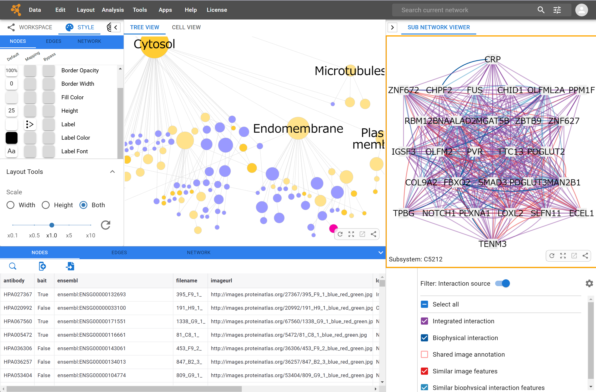

# Cytoscape Web

A web-based version of [Cytoscape](https://cytoscape.org/) built for modern browsers



# Introduction

**Cytoscape Web** is a web-based version of Cytoscape that runs in modern web browsers. This application enables users to visualize, analyze, and work with network data directly in their web browser just like the Desktop version of Cytoscape without requiring local software installation. It provides network visualization and analysis capabilities similar to the Desktop version.

The production version is available here:

- https://web.cytoscape.org/
- [User's Guide](https://cytoscape-web.readthedocs.io/en/latest/#)

## Publication

(TBA)

## App Development

Cytoscape Web is designed to expand with two types of **Apps**. We are actively researching and developing examples. Please visit the following pages for more details:

- https://github.com/cytoscape/cytoscape-web-app-examples
- [Service-based app developer guide](<https://github.com/cytoscape/cytoscape-web/wiki/Specification-for-Service-App-in-Cytoscape-Web-(draft-v2)>)

# Developer's Guide

(TBA)

! The following section is not finished yet.

---

### Build dependencies

Install `node` and `npm`. The easiest way is to download both from [offical website](https://nodejs.org/en/).

- Node.js 16.8.0 or later version is required.

After installation, run `node -v` and `npm -v` to check.

### Build instructions

Run a command using `npm <command>`. Run `npm install` before using other commands.

- `dev`: run a dev server that watches code changes, open `localhost:5500` in your web browser. By default this app points to [NDEx dev server] (https://dev.ndexbio.org), please create an account on the NDEx dev server with a email that links to your Google account before trying to setup your own dev environment for Cytoscape Web.
- `build`: build the app for production
- `lint`: lint code according to the eslint config
- `format`: format source code according to eslint and prettier configs
- `test`: run tests

### Windows-Specific Setup Instructions

For Windows users, environment variables need to be set differently. Follow these steps to run the development server.

1.  **Modify `package.json` scripts**
    Update the `dev` and `buid` scripts in `package.json` like this

    ```
     "build": "set \"REACT_APP_GIT_COMMIT=%COMMIT_HASH%\" && set \"REACT_APP_BUILD_TIMESTAMP=%BUILD_TIMESTAMP%\" && webpack --mode production",
     "dev": "set \"REACT_APP_GIT_COMMIT=%COMMIT_HASH%\" && set \"REACT_APP_BUILD_TIMESTAMP=%BUILD_TIMESTAMP%\" && webpack serve --open --mode development",
    ```

2.  **Manually set environment variables in the terminal**

    Run the Git commands manually to get your commit hash, these values will be used in `.env` file:

    ```bash
      git rev-parse HEAD
    ```

    ```bash
      git show -s --format=%cI HEAD
    ```

    Copy the output of the commands and update in `.env` file as follow :

    ```env
      REACT_APP_GIT_COMMIT=<your_commit_hash>
      REACT_APP_BUILD_TIMESTAMP=<your_build_timestamp>
    ```

    For example, if your Git commit hash is `abc1234` and the timestamp is `2024-10-24T10:00:00`, your `.env` would look like this:

    ```env
      REACT_APP_GIT_COMMIT=abc1234
      REACT_APP_BUILD_TIMESTAMP=2024-10-24T10:00:00
    ```

3.  **Start the development server**

    After setting the environment variables, run:

    ```
     npm dev
    ```

## Deploy on Netlify

All branches will have deploy previews automatically once changes pushed to github. The url is:
`branch name`--incredible-meringue-aa83b1.netlify.app

For example, if the branch is development, the url is <https:development--incredible-meringue-aa83b1.netlify.app>

It usually takes few minutes to reflect changes.

## Build for production

`export NODE_ENV=production`

`npm run build`

## Troubleshooting

This section lists solutions to problems you might encounter with Cytoscape web.

### Debug

Use developer tools in browser to check the error message. Then we recommend using Visual Studio Code debugger to debug.

### Blank Workspace or Fail to Load Any Networks

Possible solutions:

- Use a new incognito window to open Cytoscape web
- Clear browsing data include cookies
- In developer tools, go to Application page,find IndexedDB in session storage. Click `Delete database`.
