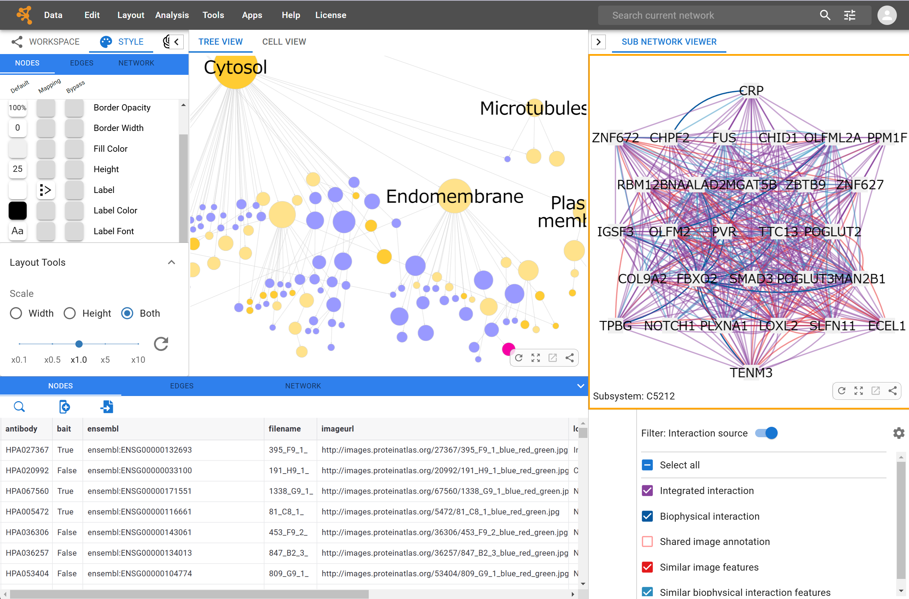
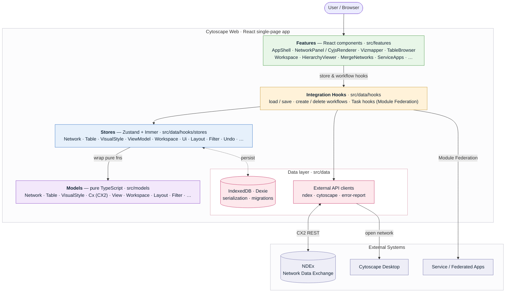

# Cytoscape Web

[](https://doi.org/10.5281/zenodo.14775458)

A web-based version of [Cytoscape](https://cytoscape.org/) built for modern browsers



# Introduction

**Cytoscape Web** is a web-based version of Cytoscape that runs in modern web browsers. This application enables users to visualize, analyze, and work with network data directly in their web browser just like the Desktop version of Cytoscape without requiring local software installation. It provides network visualization and analysis capabilities similar to the Desktop version.

The production version is available here:

- https://web.cytoscape.org/
- [User's Guide](https://cytoscape-web.readthedocs.io/en/latest/#)

## Publication

Please cite the following publication when you use it in your projects:

Keiichiro Ono, Dylan Fong, Chengzhan Gao, Christopher Churas, Rudolf Pillich, Joanna Lenkiewicz, Dexter Pratt, Alexander R Pico, Kristina Hanspers, Yihang Xin, John Morris, Mike Kucera, Max Franz, Christian Lopes, Gary Bader, Trey Ideker, Jing Chen, **Cytoscape Web: bringing network biology to the browser**, Nucleic Acids Research, 2025;, gkaf365, https://doi.org/10.1093/nar/gkaf365

## App Development

Cytoscape Web is designed to expand with two types of **Apps**. We are actively researching and developing examples. Please visit the following pages for more details:

> **⚠ New App API in active development (as of 2026)**
>
> A new JavaScript/TypeScript App API (`window.CyWebApi` / Module Federation) is under active
> development in the `new-app-api` branch. This API will become the recommended way to build
> apps and is expected to **deprecate the current Module Federation raw-store approach** once
> Phase 1 is complete. If you are starting a new app, consider waiting for or tracking
> [`@cytoscape-web/api-types`](https://www.npmjs.com/package/@cytoscape-web/api-types)
> (`@alpha`) which already publishes the Phase 0 type declarations.

- [App examples](https://github.com/cytoscape/cytoscape-web-app-examples)
- [Service-based app developer guide](<https://github.com/cytoscape/cytoscape-web/wiki/Specification-for-Service-App-in-Cytoscape-Web-(draft-v2)>)

# Developer's Guide

## Architecture

Cytoscape Web is a React single-page app built on a strict **three-layer separation** —
pure **Models**, **Stores** that wrap them, and **Features** (React components) that consume
stores through hooks. State is persisted to the browser's IndexedDB, and the app talks to
external systems (NDEx, Cytoscape Desktop, and federated Apps) through dedicated API clients
and Module Federation.


```mermaid
%%{init: {"flowchart": {"wrappingWidth": 620, "curve": "basis"}}}%%
flowchart TB
    User(["User / Browser"])

    subgraph app["Cytoscape Web · React single-page app"]
      direction TB
      Features["<b>Features</b> — React components · src/features<br/>AppShell · NetworkPanel / CyjsRenderer · Vizmapper · TableBrowser<br/>Workspace · HierarchyViewer · MergeNetworks · ServiceApps · …"]
      Hooks["<b>Integration Hooks</b> · src/data/hooks<br/>load / save · create / delete workflows · Task hooks (Module Federation)"]
      Stores["<b>Stores</b> — Zustand + Immer · src/data/hooks/stores<br/>Network · Table · VisualStyle · ViewModel · Workspace · Ui · Layout · Filter · Undo · …"]
      Models["<b>Models</b> — pure TypeScript · src/models<br/>Network · Table · VisualStyle · Cx (CX2) · View · Workspace · Layout · Filter · …"]
      subgraph datalayer["Data layer · src/data"]
        direction LR
        DB[("IndexedDB · Dexie<br/>serialization · migrations")]
        ExtApi["External API clients<br/>ndex · cytoscape · error-report"]
      end
    end

    subgraph ext["External Systems"]
      direction TB
      NDEx[("NDEx<br/>Network Data Exchange")]
      CyDesktop["Cytoscape Desktop"]
      FedApps["Service / Federated Apps"]
    end

    User --> Features
    Features -->|store & workflow hooks| Hooks
    Hooks --> Stores
    Stores -->|wrap pure fns| Models
    Stores <-.->|persist| DB
    Hooks --> ExtApi
    ExtApi <-->|CX2 REST| NDEx
    ExtApi -->|open network| CyDesktop
    Hooks -->|Module Federation| FedApps

    classDef featCls fill:#e8f6e8,stroke:#4a9a4a,color:#123
    classDef hookCls fill:#fff2d9,stroke:#c79a3a,color:#123
    classDef storeCls fill:#e6f0fb,stroke:#3a78c7,color:#123
    classDef modelCls fill:#f3e8fb,stroke:#8a4ac7,color:#123
    classDef dataCls fill:#fde8ec,stroke:#c73a6a,color:#123
    classDef extCls fill:#eeeef7,stroke:#7a7ab0,color:#123

    class Features featCls
    class Hooks hookCls
    class Stores storeCls
    class Models modelCls
    class DB,ExtApi dataCls
    class NDEx,CyDesktop,FedApps extCls
    style app fill:#fcfcfd,stroke:#c0c0cc
    style datalayer fill:#ffffff,stroke:#d8a0b0
    style ext fill:#fcfcfd,stroke:#c0c0cc
```

**Layering rules** (enforced by convention):

- **Models** (`src/models/`) are pure TypeScript — no React, no Zustand. Each domain exports a `<Domain>Fn` object of pure functions.
- **Stores** (`src/data/hooks/stores/`) are Zustand + Immer stores that wrap model operations and must not import React components. Persisted stores auto-save to IndexedDB.
- **Features** (`src/features/`) are functional React components that consume stores via hooks — either store hooks directly or the composed workflow hooks in `src/data/hooks/`.

See [`AGENTS.md`](./AGENTS.md) and the specs under [`docs/specifications/`](./docs/specifications/) for the full architecture reference.

## Quick Start

Cytoscape Web is designed to have minimum dependency to the backend services,
so you can easily run your own instance locally only with an HTTP server.

To run Cytoscape Web locally with development http server, checkout this repository and run the following:

```
npm install
npm run dev
```

This will start a local test server and opens a new browser tab.

---

! The following section is not finished yet.

### Build dependencies

The required Node.js version is specified in `.nvmrc` at the repo root. Use [nvm](https://github.com/nvm-sh/nvm) or [mise](https://mise.jdx.dev/) to manage Node versions.

**nvm** (install nvm first if needed — see [nvm install guide](https://github.com/nvm-sh/nvm#installing-and-updating)):
```bash
nvm install   # downloads the version from .nvmrc if not already cached, then activates it
```

**mise** (install mise first if needed — see [mise install guide](https://mise.jdx.dev/getting-started.html)):
```bash
mise install  # installs and activates the version from .nvmrc
```

After switching, run `node -v` and `npm -v` to confirm. The correct version is enforced at install time — running `npm install` with the wrong Node version will fail.

### Build instructions

Run a command using `npm <command>`. Run `npm install` before using other commands.

- `dev`: run a dev server that watches code changes, open `localhost:5500` in your web browser. By default this app points to [NDEx dev server] (https://dev.ndexbio.org), please create an account on the NDEx dev server with a email that links to your Google account before trying to setup your own dev environment for Cytoscape Web.
- `build`: build the app for production
- `lint`: type-check with TypeScript and lint source code with oxlint
- `format`: format source code with Prettier
- `test:unit`: run Vitest unit tests
- `test:checks`: run lint and unit tests in parallel (no e2e)
- `test:e2e`: run Playwright end-to-end tests (all configured browsers)

Each test script also has a `:quiet` variant that prints only failures and a final summary (no per-test output, test stdio, or debug-logger noise) — useful for CI logs and AI agents:

- `test:quiet`: quiet version of `npm test` (lint ∥ unit, then Chromium e2e)
- `test:checks:quiet`: quiet lint + unit tests in parallel (no e2e)
- `test:unit:quiet`: quiet Vitest unit tests
- `test:coverage:quiet`: quiet unit tests with coverage
- `test:e2e:quiet`: quiet Playwright tests (all configured browsers)
- `test:e2e:chromium:quiet`: quiet Playwright tests (Chromium only)

#### Installing Playwright browsers

Playwright manages its own browser binaries separately from system browsers. After `npm install`, install the browsers before running E2E tests:

```bash
# Install all three browsers (Chromium, Firefox, WebKit)
npx playwright install

# Or install a single browser
npx playwright install chromium
npx playwright install firefox
npx playwright install webkit
```

You only need to re-run this when the `@playwright/test` version changes (e.g., after `npm install` pulls a new version).

#### Running E2E tests against a specific browser locally

By default `test:e2e` runs all browser projects defined in `playwright.config.ts`. To target a specific browser, pass `--project` after `--`:

```bash
npm run test:e2e -- --project=chromium
npm run test:e2e -- --project=firefox
npm run test:e2e -- --project=webkit
npm run test:e2e -- --project=chromium --project=webkit
```

Available project names are `chromium`, `firefox`, and `webkit` (matching `playwright.config.ts`).

### Windows

No Windows-specific setup is required. Build metadata (git commit, timestamps) is computed automatically inside `vite.config.ts`, and scripts that set environment variables use `cross-env`, so `npm run dev`, `npm run build`, and the test commands work the same on Windows, macOS, and Linux.

## Build for production

Before building for production, you **must** update `src/assets/config.json` with the
correct values for your target deployment environment. The `config.json` checked into
this repository is configured for the NDEx development server (`dev1.ndexbio.org`) and
**must not** be used as-is for production builds.

### Configuring for Different Environments

The runtime configuration is stored in `src/assets/config.json` and is bundled into
the app at build time. You must update this file before running `npm run build` to
ensure the deployed app points to the correct servers and endpoints.

Key fields to update for each environment:

| Field | Development | Production (web.cytoscape.org) |
|---|---|---|
| `ndexBaseUrl` | `dev1.ndexbio.org` | `www.ndexbio.org` |
| `keycloakConfig.url` | `https://dev1.ndexbio.org/auth2` | `https://www.ndexbio.org/auth2` |
| `errorReportEndpoint` | `https://dev1.ndexbio.org/report` | `https://www.ndexbio.org/report` |
| `googleAnalyticsId` | `""` (empty to disable) | Your production GA measurement ID |
| `urlBaseName` | `"/"` | Path prefix of your deployment (e.g. `"/"`) |

`allowsLocalhostAppsOn` is deliberately **not** in that table and needs no edit.
It names the one origin allowed to install apps from a developer's `localhost`,
and the host honours it only when it equals the origin actually being served —
so the development value carried into a production build matches nothing and
does nothing. Leave it alone unless you are enabling that flow for a deployment
you operate, in which case set it to that deployment's own origin.

Reference config files are provided in `src/assets/`:
- `config.dev.json` — values for the NDEx development server
- `config-test.txt` — values for the NDEx test server

To build for production:

1. Copy the appropriate reference config or start from the current `config.json`
2. Update each field to match your production environment (see the table above)
3. Build the app:

```bash
npm run build
```

> **⚠ Important**: If `errorReportEndpoint` points to a different origin than the one
> where the app is served, that server must allow CORS requests from your app's domain.
> Using a development endpoint (e.g. `dev1.ndexbio.org`) in a production deployment
> will cause bug reports to fail with a CORS error.

## Troubleshooting

This section lists solutions to problems you might encounter with Cytoscape web.

### Debug

Use developer tools in browser to check the error message. Then we recommend using Visual Studio Code debugger to debug.

### Blank Workspace or Fail to Load Any Networks

Possible solutions:

- Use a new incognito window to open Cytoscape web
- Clear browsing data include cookies
- In developer tools, go to Application page,find IndexedDB in session storage. Click `Delete database`.

---

# Release Management

When you need to create a new release, please follow these steps:

1. Merge [development branch](https://github.com/cytoscape/cytoscape-web/tree/development) into [master](https://github.com/cytoscape/cytoscape-web/tree/master).
2. Tag the master branch
3. [Create a new release in GitHub](https://github.com/cytoscape/cytoscape-web/releases/new)
4. Once released, check [Zenodo account](https://doi.org/10.5281/zenodo.14775458) and make sure it is linked to the new release.
5. Check the doi badge and make sure the link is correct.
6. Update the version number in the development branch for the next release.
