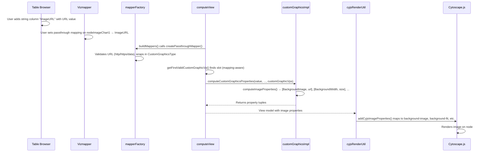

# Custom Graphics Image Passthrough

## Overview

Enable users to input image URL strings into Table Browser columns and use passthrough mappings on Custom Graphics visual properties (e.g., `nodeImageChart1`) to render those images on nodes in Cytoscape.js.

## Context

The custom graphics system already supports pie charts and ring charts via default values and bypasses. Image support (`CustomGraphicsNameType.Image`) exists as a type but is unimplemented — `computeImageProperties` is a stub and `computeCustomGraphicsProperties` returns `[]` for Image types. This design fills that gap by enabling the passthrough mapping path.

Related files:
- Behavioral docs: `src/models/VisualStyleModel_docs/customGraphicsImpl.md`
- Type definitions: `src/models/VisualStyleModel/VisualPropertyValue/CustomGraphicsType.ts`

## Design

### Data Flow



### Components

#### Mapper Layer — `mapperFactory.ts`

`createPassthroughMapper` gains a new branch: when `visualPropertyType` is `CustomGraphic` and the value is a string, it validates the URL and wraps it into a `CustomGraphicsType` object:

```typescript
{
  type: CustomGraphicsTypeType.Image,
  name: CustomGraphicsNameType.Image,
  properties: { url: theString },
}
```

- **URL validation**: Lightweight check — strings must start with `http://`, `https://`, or `data:`. Non-matching strings fall back to the VP's default value.
- **Non-string values**: Passed through unchanged (supports existing CustomGraphicsType objects from bypasses/defaults).

#### Model Types — `CustomGraphicsType.ts`

Uncomment and finalize `ImagePropertiesType`:

```typescript
export interface ImagePropertiesType {
  tag?: string
  url: string
  id?: number
}
```

Add to the `CustomGraphicsType.properties` union.

#### VP Selection — `customGraphicsImpl.ts`

`getFirstValidCustomGraphicVp` is updated to consider VPs with an active `mapping` as valid. Currently it only checks `defaultValue` and `bypassMap`. Without this change, a passthrough-only slot (with `None` default) would never be picked when another slot has a PieChart.

#### Image Property Computation — `customGraphicsImpl.ts`

`computeImageProperties` is implemented to return property tuples:

| Property | Value | Source |
|----------|-------|--------|
| `BackgroundImage` | URL string | `ImagePropertiesType.url` |
| `BackgroundWidth` | `${size}px` | Slot-specific `nodeImageChartSizeX` VP |
| `BackgroundHeight` | `${size}px` | Same as width (square bounding box) |
| `BackgroundFit` | `contain` | Hardcoded (preserves aspect ratio) |
| `BackgroundImageCrossorigin` | `anonymous` | Hardcoded (enables CORS) |

`computeCustomGraphicsProperties` gains `firstValidCustomGraphicVp` and `customGraphicVps` parameters so it can find the slot-specific size VP via `getSizePropertyForCustomGraphic` for the Image branch.

#### Property Cleanup — `directMappingSelector.ts` + `customGraphicsImpl.ts`

New `SpecialPropertyName` constants:

```typescript
BackgroundImage: 'backgroundImage',
BackgroundFit: 'backgroundFit',
BackgroundWidth: 'backgroundWidth',
BackgroundHeight: 'backgroundHeight',
BackgroundImageCrossorigin: 'backgroundImageCrossorigin',
```

These are registered in `getCustomGraphicsPropertyKeys()` so the cleanup loop in `cyjsRenderUtil.ts` (lines 497–506) properly removes stale image properties when switching to a different custom graphic type.

#### Rendering — `cyjsRenderUtil.ts`

`addCyjsImageProperties()` is implemented to register `CyjsDirectMapper` entries mapping the `SpecialPropertyName` data fields to Cytoscape.js style properties (`background-image`, `background-fit`, `background-width`, `background-height`, `background-image-crossorigin`).

### View Computation — `computeViewUtil.ts`

All 3 call sites to `computeCustomGraphicsProperties` pass the additional `firstValidCustomGraphicVp` and `customGraphicNodeVps` arguments.

## Key Decisions

### Single-Slot Constraint

Only one custom graphic slot is active at a time (the first valid one). A user cannot have both a pie chart and an image on the same node. This is consistent with the existing pie/ring chart behavior.

### URL Validation in the Mapper

The passthrough mapper performs lightweight URL validation (`http://`, `https://`, `data:` prefix check) rather than accepting any string or doing full URL parsing. This catches accidental column mismatches while keeping the implementation simple.

### Image Sizing via Slot-Specific Size VP

Images use `background-fit: contain` with dimensions from the slot-specific `nodeImageChartSizeX` VP, not the node width/height. This gives users explicit control over image size via the Vizmapper, matching how custom graphic sizes work in Cytoscape Desktop.

### CORS Default

`background-image-crossorigin: anonymous` is set by default to allow cross-origin images from CORS-enabled servers, with no negative effect on same-origin images.

### CX Round-Trip

No special CX export/import handling is needed. `convertPassthroughMappingToCX` exports the attribute reference; on re-import, `createPassthroughMapper` reconstructs the `CustomGraphicsType` from string values at render time.

### No Table Browser UI Changes

Standard string columns hold image URLs. No special input widget or preview is needed.

## Files Changed

| File | Change |
|------|--------|
| `src/models/VisualStyleModel/VisualPropertyValue/CustomGraphicsType.ts` | Uncomment `ImagePropertiesType`, add to union |
| `src/models/VisualStyleModel/impl/mapperFactory.ts` | URL→CustomGraphicsType wrapping in passthrough mapper |
| `src/models/VisualStyleModel/impl/customGraphicsImpl.ts` | VP selection update, `computeImageProperties`, dispatch update, property keys |
| `src/models/VisualStyleModel/impl/CyjsProperties/CyjsStyleModels/directMappingSelector.ts` | Image `SpecialPropertyName` constants |
| `src/models/VisualStyleModel/impl/computeViewUtil.ts` | Pass custom graphic VPs to `computeCustomGraphicsProperties` |
| `src/features/NetworkPanel/CyjsRenderer/cyjsRenderUtil.ts` | Implement `addCyjsImageProperties()` |

## Verification Plan

### Automated Tests

1. **`mapperFactory.test.ts`**: Passthrough mapper wraps valid URLs, rejects non-URLs, handles `data:` URIs, passes non-string values through
2. **`customGraphicsImpl.test.ts`**: VP selection finds mapping-aware slots, `computeImageProperties` returns correct tuples, property keys include image keys
3. **Full suite**: `npm run test:unit`

### Manual Verification

1. Create a network, add a string column `ImageURL` in the Table Browser
2. Paste a valid image URL into a node's cell
3. In Vizmapper, set passthrough mapping on `nodeImageChart1` → `ImageURL`
4. Verify image renders on the node with correct sizing
5. Switch to a pie chart and verify image is cleared (property cleanup)
6. Save and reload to verify CX round-trip
