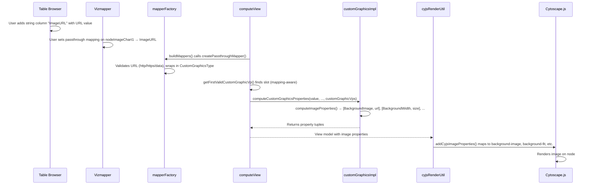

# Custom Graphics Image Passthrough

## Overview

Enable users to input image URL strings into Table Browser columns and use passthrough mappings on Custom Graphics visual properties (e.g., `nodeImageChart1`) to render those images on nodes in Cytoscape.js.

## Context

The custom graphics system already supports pie charts and ring charts via default values and bypasses. Image support (`CustomGraphicsNameType.Image`) exists as a type but is unimplemented — `computeImageProperties` is a stub and `computeCustomGraphicsProperties` returns `[]` for Image types. This design fills that gap by enabling the passthrough mapping path.

Related files:
- Behavioral docs: `src/models/VisualStyleModel_docs/customGraphicsImpl.md`
- Type definitions: `src/models/VisualStyleModel/VisualPropertyValue/CustomGraphicsType.ts`

## Design

### Data Flow



### Components

#### Mapper Layer — `mapperFactory.ts`

`createPassthroughMapper` gains a new branch: when `visualPropertyType` is `CustomGraphic` and the value is a string, it validates the URL and wraps it into a `CustomGraphicsType` object:

```typescript
{
  type: CustomGraphicsTypeType.Image,
  name: CustomGraphicsNameType.Image,
  properties: { url: theString },
}
```

- **URL validation**: Lightweight check — strings must start with `http://`, `https://`, or `data:`. Non-matching strings fall back to the VP's default value.
- **Non-string values**: Passed through unchanged (supports existing CustomGraphicsType objects from bypasses/defaults).

#### Model Types — `CustomGraphicsType.ts`

Uncomment and finalize `ImagePropertiesType`:

```typescript
export interface ImagePropertiesType {
  tag?: string
  url: string
  id?: number
}
```

Add to the `CustomGraphicsType.properties` union.

#### VP Selection — `customGraphicsImpl.ts`

`getFirstValidCustomGraphicVp` is updated to consider VPs with an active `mapping` as valid. Currently it only checks `defaultValue` and `bypassMap`. Without this change, a passthrough-only slot (with `None` default) would never be picked when another slot has a PieChart.

#### Image Property Computation — `customGraphicsImpl.ts`

`computeImageProperties` is implemented to return property tuples:

| Property | Value | Source |
|----------|-------|--------|
| `BackgroundImage` | URL string | `ImagePropertiesType.url` |
| `BackgroundWidth` | `${size}px` | Slot-specific `nodeImageChartSizeX` VP |
| `BackgroundHeight` | `${size}px` | Same as width (square bounding box) |
| `BackgroundFit` | `contain` | Hardcoded (preserves aspect ratio) |
| `BackgroundImageCrossorigin` | `null` | Hardcoded (see CORS Default below) |

`computeCustomGraphicsProperties` gains `firstValidCustomGraphicVp` and `customGraphicVps` parameters so it can find the slot-specific size VP via `getSizePropertyForCustomGraphic` for the Image branch.

#### Property Cleanup — `directMappingSelector.ts` + `customGraphicsImpl.ts`

New `SpecialPropertyName` constants:

```typescript
BackgroundImage: 'backgroundImage',
BackgroundFit: 'backgroundFit',
BackgroundWidth: 'backgroundWidth',
BackgroundHeight: 'backgroundHeight',
BackgroundImageCrossorigin: 'backgroundImageCrossorigin',
```

These are registered in `getCustomGraphicsPropertyKeys()` so the cleanup loop in `cyjsRenderUtil.ts` (lines 497–506) properly removes stale image properties when switching to a different custom graphic type.

#### Rendering — `cyjsRenderUtil.ts`

`addCyjsImageProperties()` is implemented to register `CyjsDirectMapper` entries mapping the `SpecialPropertyName` data fields to Cytoscape.js style properties (`background-image`, `background-fit`, `background-width`, `background-height`, `background-image-crossorigin`).

### View Computation — `computeViewUtil.ts`

All 3 call sites to `computeCustomGraphicsProperties` pass the additional `firstValidCustomGraphicVp` and `customGraphicNodeVps` arguments.

## Key Decisions

### Single-Slot Constraint

Only one custom graphic slot is active at a time (the first valid one). A user cannot have both a pie chart and an image on the same node. This is consistent with the existing pie/ring chart behavior.

### URL Validation in the Mapper

The passthrough mapper performs lightweight URL validation (`http://`, `https://`, `data:` prefix check) rather than accepting any string or doing full URL parsing. This catches accidental column mismatches while keeping the implementation simple.

### Image Sizing via Slot-Specific Size VP

Images use `background-fit: contain` with dimensions from the slot-specific `nodeImageChartSizeX` VP, not the node width/height. This gives users explicit control over image size via the Vizmapper, matching how custom graphic sizes work in Cytoscape Desktop.

### CORS Default

`background-image-crossorigin: null` is set (a valid Cytoscape.js enum value meaning "do not set the `crossOrigin` attribute"). This maximizes reach — images load even from servers without CORS headers — at the cost of tainting the canvas, so those images are excluded from PNG/JPEG export. Switch to `anonymous` if export fidelity matters more than loading non-CORS images.

### CX Round-Trip

For the **passthrough** path, `convertPassthroughMappingToCX` exports the attribute reference; on re-import, `createPassthroughMapper` reconstructs the `CustomGraphicsType` from string values at render time.

Round-tripping to **Cytoscape Desktop**, however, needs several compatibility adaptations — see the next section.

## Cytoscape Desktop Compatibility

Image custom graphics authored in Cytoscape Web must survive export to Cytoscape Desktop (via "Open Network in Cytoscape Desktop" or a downloaded `.cx2`). Empirically verified against Desktop **3.10.3** using `scripts/desktop-roundtrip/`.

| Concern | Desktop behavior | Handling in Cytoscape Web |
|---------|------------------|---------------------------|
| **Raster vs. vector class** | Desktop uses two custom-graphics factories: `...bitmap.URLImageCustomGraphics` (tag `"bitmap image"`) for raster and `...image.SVGCustomGraphics` (tag `"vector image"`) for SVG. Labeling SVG as the bitmap class makes Desktop raster-decode it → "?" placeholder. | `CustomGraphicsNameType.SVGImage`; the mapper and `vpToCX` pick the class from URL content via `isSvgImageUrl()`. `isImageCustomGraphicsName()` gates all image branches so imported Desktop SVG renders too. |
| **Image bytes are not carried by CX2** | Desktop loads custom-graphic image bytes from its session/app-data `CustomGraphicsManager` pool, **not** from the CX2. On import into a fresh session it keeps only the reference (`class, id, name, tag`); the `properties.url` is reduced to a filename and **never fetched — for any scheme (http, https, data, file)**. Empirically confirmed by rendering imported views: hosted URLs, data URIs, and existing local files all show "?". Desktop's framework log shows no fetch attempt. (This is why STRING images require the stringApp installed — that app pools the images via Java, not via CX2.) | Image custom graphics render in Cytoscape Web but **cannot** be made to display in Desktop through CX2 export alone. `hasDataUriCustomGraphics()` + the `useOpenInCytoscapeDesktop` warning flag the (worst) data-URI case; a broader "image custom graphics may not display in Desktop" warning is the honest UX. True parity would require CW to populate Desktop's pool via CyREST commands, or a Desktop-side reader change. |
| **Custom-graphic sizes** | `NODE_CUSTOMGRAPHICS_SIZE_*` is cast to `Double`; a JSON integer (`50`) throws `ClassCastException`. | `vpToCX` exports the size as a formatted string (`"50.0"`), which Desktop parses as a Double. `VPNumberConverter`/`VPCustomGraphicsSizeConverter` `parseFloat` it back on import. |
| **Missing `tag`/`id`** | An image custom graphic missing `tag` or `id` throws `NullPointerException` during view creation. | `vpToCX` injects `tag` (per class) and a deterministic URL-hash `id`. |

**Known limitations / follow-ups:**

- **`NODE_CUSTOMGRAPHICS_POSITION_*` is not applied when rendering images** — only size is used (`computeImageProperties`). Desktop honors position. Mapping the Desktop anchor/margin model onto Cytoscape.js `background-position-*` / `background-offset-*` is a pending feature.
- Only the **first valid custom-graphics slot** is honored (single-slot). No multi-slot layering.
- Image custom graphics support **passthrough, default, and bypass**, but not discrete mappings.
- The passthrough mapping definition drops the `type` field on round-trip when the attribute type is not captured; verified non-breaking on Desktop 3.10.3 import, but non-conformant with Desktop's own output.

### Shipping Decision: Authoring Withheld, Passthrough Kept

Because the "image bytes are not carried by CX2" row above is a Desktop architectural limitation and **not** something Cytoscape Web can fix by changing its output, this feature ships deliberately asymmetric:

| Capability | Status | Where |
|------------|--------|-------|
| **Rendering** images (defaults, bypasses, passthrough, imported CX2, Desktop-authored SVG) | **Enabled** | `computeImageProperties`, `addCyjsImageProperties`, `CustomGraphicRender` |
| **Authoring** an image from scratch in the custom-graphics picker | **Withheld** | `AUTHORABLE_CUSTOM_GRAPHIC_KINDS` in `.../CustomGraphics/utils/constants.ts` |
| **Authoring** via a string column + passthrough mapping on `nodeImageChart*` | **Enabled** | `valueType2BaseType[CustomGraphic] = 'string'` in `mappingFunctionImpl.ts` |
| **Editing** an image value that already exists | **Enabled** | `availableKinds` in `CustomGraphicDialog.tsx` |

Rationale: a picker that offers "Image" implies the result is a first-class, portable value. It is not — it renders in Web and shows `?` in Desktop. Withholding the option avoids manufacturing broken files through the most discoverable path, while the passthrough route stays available to users who are driving images from data and can be told about the caveat.

Two consequences worth knowing:

- The picker still shows the Image card **when the value being edited is already an image** — imported from a CX2, or authored before this restriction. Without that carve-out the dialog would open with `kind` hydrated to image and no card highlighted, and the only escape would be clicking Pie, silently discarding the image. This is also what keeps `ImageForm.tsx` reachable rather than dead code.
- Because passthrough authoring remains, the Desktop caveat is surfaced at every export path a person watches — "Open in Cytoscape Desktop", the CX2 download, and both NDEx saves — via `hasImageCustomGraphics()` and the shared `IMAGE_CUSTOM_GRAPHICS_DESKTOP_WARNING`. All of those emit byte-identical CX2, so warning on only the Desktop hand-off would cover a fraction of the exposure. The Vizmapper's existing `nodeImageChart` advisory tooltip carries the same caveat at authoring time.

**To re-enable image authoring** once Desktop parity exists (CW populating Desktop's pool over CyREST, or a Desktop-side reader change): add `CustomGraphicsNameType.Image` back to `AUTHORABLE_CUSTOM_GRAPHIC_KINDS`. That is the whole change — all three type-card grids read from that list. The `CustomGraphicDialog.spec.tsx` assertions and the `mappingFunctionImpl.test.ts` passthrough guard will need updating to match the new intent.

### No Table Browser UI Changes

Standard string columns hold image URLs. No special input widget or preview is needed.

## Files Changed

| File | Change |
|------|--------|
| `src/models/VisualStyleModel/VisualPropertyValue/CustomGraphicsType.ts` | Uncomment `ImagePropertiesType`, add to union; add `SVGImage` class + `isImageCustomGraphicsName()` / `isSvgImageUrl()` |
| `src/models/VisualStyleModel/impl/mapperFactory.ts` | URL→CustomGraphicsType wrapping in passthrough mapper; SVG-vs-raster class selection |
| `src/models/VisualStyleModel/impl/customGraphicsImpl.ts` | VP selection update, `computeImageProperties`, dispatch update, property keys; image branches gated on `isImageCustomGraphicsName()` |
| `src/models/VisualStyleModel/impl/cxVisualPropertyConverter.ts` | Desktop-compat in `vpToCX`: SVG-vs-raster class + tag, size stringification, `tag`/`id` injection |
| `src/models/VisualStyleModel/impl/CyjsProperties/CyjsStyleModels/directMappingSelector.ts` | Image `SpecialPropertyName` constants |
| `src/models/VisualStyleModel/impl/computeViewUtil.ts` | Pass custom graphic VPs to `computeCustomGraphicsProperties` |
| `src/models/CxModel/impl/customGraphicsCompat.ts` | `hasDataUriCustomGraphics()` / `hasImageCustomGraphics()` — detect Desktop-incompatible images; shared warning text |
| `src/data/hooks/useOpenInCytoscapeDesktop.ts` | Warn on image custom graphics before sending to Desktop |
| `src/data/hooks/useDownloadNetworkFile.ts` | Same warning before a `.cx2` download (identical bytes) |
| `src/data/hooks/useSaveCyNetworkToNDEx.ts`, `useSaveCyNetworkCopyToNDEx.ts` | Same warning before an NDEx save |
| `src/features/Vizmapper/index.tsx` | Desktop caveat added to the existing `nodeImageChart` advisory tooltip |
| `.../CustomGraphics/utils/constants.ts` | `AUTHORABLE_CUSTOM_GRAPHIC_KINDS` — the single gate for which kinds the picker offers |
| `.../CustomGraphics/CustomGraphicDialog.tsx` | Both type-card grids read `availableKinds`; image kept only when editing an existing image |
| `.../CustomGraphics/WizardSteps/SelectTypeStep.tsx` | Third type-card copy reads the same list via an `availableKinds` prop |
| `src/features/NetworkPanel/CyjsRenderer/cyjsRenderUtil.ts` | Implement `addCyjsImageProperties()` |
| `scripts/desktop-roundtrip/` | Standalone CyREST round-trip harness for Desktop verification |

## Verification Plan

### Automated Tests

1. **`mapperFactory.test.ts`**: Passthrough mapper wraps valid URLs, rejects non-URLs, handles `data:` URIs, passes non-string values through
2. **`customGraphicsImpl.test.ts`**: VP selection finds mapping-aware slots, `computeImageProperties` returns correct tuples, property keys include image keys
3. **Full suite**: `npm run test:unit`

### Manual Verification

1. Create a network, add a string column `ImageURL` in the Table Browser
2. Paste a valid image URL into a node's cell
3. In Vizmapper, set passthrough mapping on `nodeImageChart1` → `ImageURL`
4. Verify image renders on the node with correct sizing
5. Switch to a pie chart and verify image is cleared (property cleanup)
6. Save and reload to verify CX round-trip
