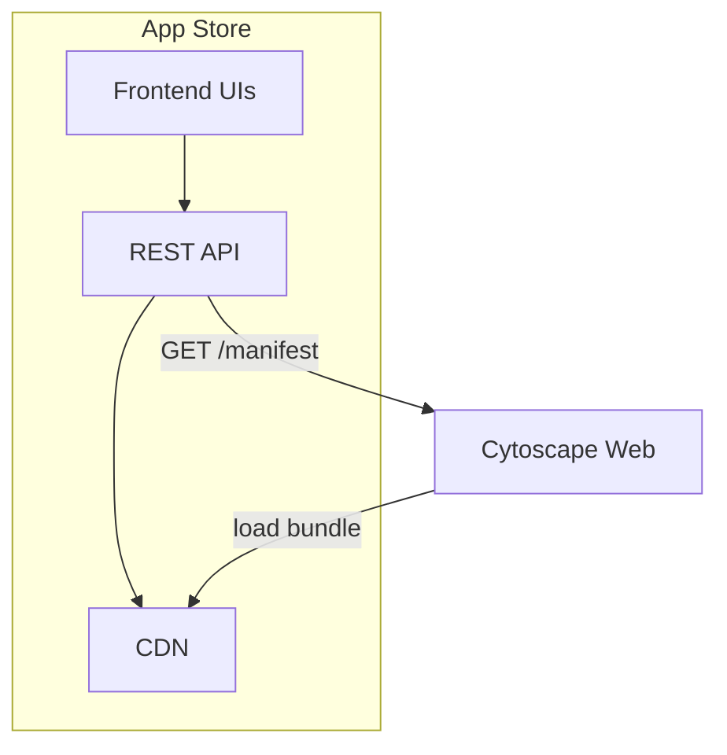
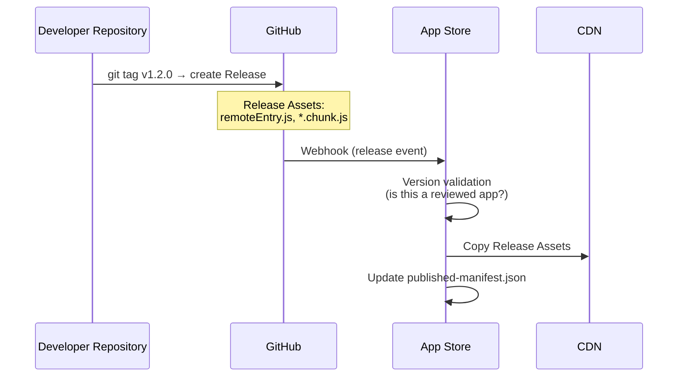
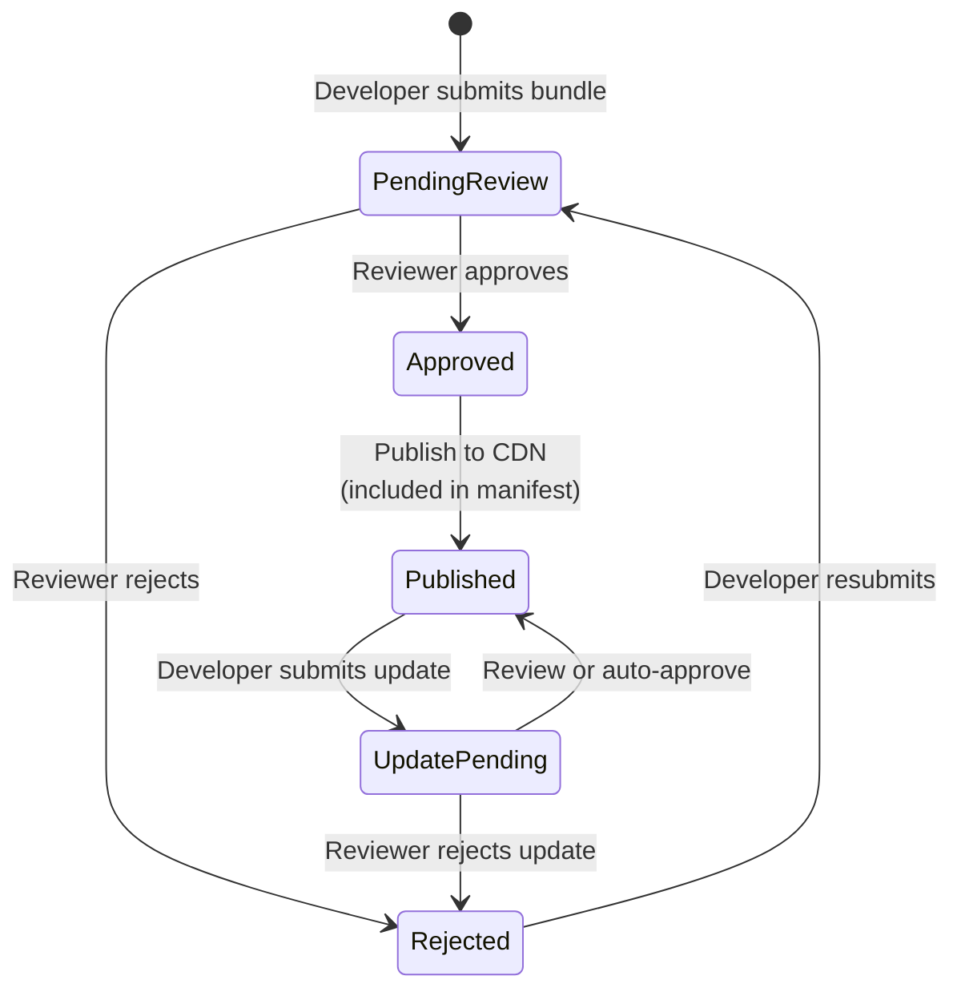

# Cytoscape Web App Store — Design Exploration

> **Status: Brainstorming / Future Work**
>
> This document captures design ideas for a **Cytoscape Web App Store** — an
> external service that is **not part of this repository** and will be
> implemented as a separate project. Nothing described here is planned for
> implementation within cytoscape-web itself.
>
> The purpose of this document is to record the results of early design
> discussions so that they are available as a starting point when work on the
> App Store begins. Treat every section as a proposal, not a commitment.
> Requirements, architecture, and technology choices are all subject to change.

- Rev. 1 (3/20/2026): Keiichiro ONO and Claude — Initial brainstorming

---

## TL;DR

- **No build-time app list.** Phase 4 removes the static app list dependency.
  The host loads manifests dynamically from the official store, any URL, or a
  local file — no code changes needed to switch sources.
- **Bundles are small and easy to distribute.** A typical Module Federation
  `remoteEntry.js` + chunks is a few hundred KB. Apps can be served from the
  official CDN, GitHub Pages, or any static host.
- **Official App Store uses a managed CDN model.** Reviewed bundles are served
  from `apps.cytoscape.org/web/` to guarantee integrity.
- **Human review required for every release.** CI runs automated checks
  (build, security, compatibility) first; a core team member must then
  approve before publication. No auto-approve regardless of version type.
- **Leverage the GitHub ecosystem.** GitHub Actions for CI, Releases for
  update ingestion, repository metadata extraction, and direct Issues links
  minimize custom infrastructure.
- **Defense in depth via runtime sandboxing.** CSP, API Proxy capability
  control, and DOM scope isolation limit damage from code that passes review.

---

## 1. Context

Phase 4 of the Module Federation design (see
[runtime-app-registration-specification.md](runtime-app-registration-specification.md))
introduces runtime app registration: the host fetches a manifest at startup,
presents a catalog to the user, and dynamically loads selected apps via Module
Federation. The manifest is a static JSON array of `AppCatalogEntry` objects.

The next logical step is to provide a centralized **App Store** where
third-party developers can publish apps and users can discover them. The
existing Cytoscape Desktop App Store (<https://apps.cytoscape.org/>) serves as
a reference point, but the web version differs fundamentally in its
distribution model: instead of downloadable JAR files, apps are Module
Federation remotes served as JavaScript bundles.

## 2. Goals

1. Allow third-party developers to submit and publish Cytoscape Web apps
2. Provide a human review process before apps become publicly available
3. Serve a manifest endpoint that Cytoscape Web can consume directly
4. Host reviewed app bundles on a CDN so that bundle integrity is guaranteed
5. Leverage the GitHub ecosystem to minimize custom infrastructure

## 3. Hosting Model: CDN-Hosted (Managed)

Two hosting models were evaluated:

| Model | Description | Pros | Cons |
|-------|-------------|------|------|
| **A. URL Registry** | Store only records metadata + URLs; developers host their own bundles | Lightweight infra | Cannot guarantee bundle integrity after review |
| **B. CDN Hosted** | Store accepts bundle uploads and serves them from its own CDN | Reviewed code is immutable; URL stability guaranteed | Requires upload pipeline and storage infra |

**Decision: Model B (CDN Hosted)** — If bundles are hosted externally,
developers can silently replace reviewed code with malicious updates, making
the review process meaningless. The App Store must control the serving
infrastructure to ensure that what was reviewed is what users load.

### CDN URL Structure

```
https://apps.cytoscape.org/web/{appId}/{version}/remoteEntry.js
https://apps.cytoscape.org/web/{appId}/{version}/chunks/*.js
```

Each published version is immutable once deployed. Updates require a new
version submission.

## 4. Architecture Overview



**App Store layers:**

| Layer | Components |
|-------|-----------|
| Frontend UIs | Developer Portal, Review Dashboard, Public Catalog |
| REST API | `POST /apps`, `POST /apps/:id/versions`, `PATCH /apps/:id/review`, `GET /manifest`, `GET /apps/:id`, `GET /apps` |
| CDN | `/{appId}/{version}/remoteEntry.js`, `/{appId}/{version}/chunks/*.js` |

**Cytoscape Web flow:** `obtainCatalogEntries` → fetch manifest → populate catalog → user activates → load `remoteEntry.js` from CDN

## 5. Manifest Integration

The App Store's `GET /manifest` endpoint returns an array of
`AppCatalogEntry` objects as defined in the runtime app registration
specification (§6.4). This means the host requires **zero App Store–specific
code** — it simply fetches the manifest URL and processes it through the
existing `obtainCatalogEntries` pipeline.

```json
[
  {
    "id": "hello",
    "name": "Hello World",
    "url": "https://apps.cytoscape.org/web/hello/1.2.0/remoteEntry.js",
    "author": "Cytoscape Team",
    "description": "A simple hello world app",
    "version": "1.2.0",
    "tags": ["demo", "getting-started"],
    "icon": "https://apps.cytoscape.org/icons/hello.png",
    "license": "MIT",
    "repository": "https://github.com/cytoscape/cytoscape-web-app-examples",
    "compatibleHostVersions": ">=1.0.0"
  }
]
```

The `DEFAULT_MANIFEST_URL` constant in Cytoscape Web will point to this
endpoint once the App Store is deployed.

## 6. GitHub Ecosystem Integration

A central design principle is to leverage existing GitHub infrastructure
rather than building custom equivalents.

### 6.1 Automated Review via GitHub Actions

CI checks run on every app submission:

```yaml
# .github/workflows/app-review.yml
on:
  pull_request:
    paths: ['apps/*/manifest.json']

jobs:
  validate:
    steps:
      # 1. Schema validation
      #    - manifest.json conforms to expected schema

      # 2. Clone app repository
      #    - Clone the GitHub repository referenced in manifest.json

      # 3. Build verification
      #    - npm install && npm run build succeeds

      # 4. Bundle analysis
      #    - Bundle size check
      #    - Static analysis for dangerous API usage

      # 5. Federation compatibility
      #    - remoteEntry.js is generated correctly
      #    - Shared singletons (React, MUI) version compatibility

      # 6. Security scan
      #    - npm audit for known vulnerabilities
      #    - Detection of eval(), innerHTML, document.cookie usage

      # 7. Sandbox test
      #    - Load the app in a headless host instance
      #    - Verify it mounts and unmounts without errors
```

Human reviewers only need to examine PRs that pass all automated checks,
significantly reducing review burden.

### 6.2 Release-Driven Updates

App updates are triggered by GitHub Releases on the app's source repository:



**Review policy:**

All submissions — initial and updates alike — go through a two-stage review:

1. **Automated review (CI)** — schema validation, build verification, bundle
   analysis, security scan, federation compatibility check (see §6.1)
2. **Human review** — a core team member inspects the submission and
   approves or rejects it

No version is published to the CDN without explicit human approval. Automated
checks serve to **reduce reviewer burden** (reviewers only examine submissions
that pass CI), not to replace human judgment.

**CI risk flags** that reviewers should pay special attention to:

- New `fetch()` or `XMLHttpRequest` calls to previously unseen domains
- Addition of `eval()`, `Function()`, or `innerHTML` assignments
- New access to `document.cookie`, `localStorage`, or `sessionStorage`
- Significant bundle size increase (>50% or >500 KB absolute)

These flags are surfaced in the CI report but do not automatically block
publication — the human reviewer makes the final call.

### 6.3 Source Repository Metadata

The App Store automatically extracts metadata from the app's GitHub
repository, reducing manual data entry:

| Source | Extracted fields |
|--------|-----------------|
| `package.json` | `name`, `version`, `description`, `license`, `author` |
| `README.md` | Store page description (rendered) |
| `app-store.json` | Cytoscape-specific metadata (see below) |
| `LICENSE` | License type |
| GitHub Topics | Tags |
| GitHub API | Contributors, last commit date, open issues, CI status |

**`app-store.json`** — optional Cytoscape Web–specific config in the app repo:

```json
{
  "id": "my-app",
  "icon": "./assets/icon.png",
  "tags": ["network-analysis", "clustering"],
  "minHostApiVersion": "1.0.0",
  "federationName": "myApp",
  "exposedModule": "./AppConfig"
}
```

### 6.4 Issue Tracking Integration

The App Store links directly to the app's GitHub repository for support:

- "Report a Bug" → `https://github.com/{owner}/{repo}/issues/new?template=bug_report.md`
- "Request a Feature" → `https://github.com/{owner}/{repo}/issues/new?template=feature_request.md`

No custom forum or comment system is needed.

## 7. App Lifecycle



### 7.1 App Detail Page

The public catalog page for each app displays:

| Field | Source |
|-------|--------|
| Name, icon, description | Manifest / `app-store.json` |
| Author | GitHub profile |
| Version history | GitHub Releases |
| License | `LICENSE` / `package.json` |
| Tags / categories | `app-store.json` / GitHub Topics |
| Activation count | App Store tracking |
| Rating (5-star) | App Store (user submissions) |
| Repository link | GitHub URL |
| Last commit date | GitHub API |
| Open issues count | GitHub API |
| CI status | GitHub Status API |
| Security status | GitHub Advisory API |
| Bundle size | Measured at build time |

### 7.2 Repository Health Monitoring

The App Store periodically checks registered repositories for signs of
abandonment or security issues:

- **Stale repository** — no commits for an extended period → display warning
  on the store page
- **Security advisory** — GitHub Advisory DB flags a dependency vulnerability
  → notify developer (auto-create GitHub Issue), display warning on store
  page, optionally unpublish if critical and unpatched
- **Archived repository** — GitHub API reports the repo as archived → mark
  app as unmaintained in the store

## 8. Security Considerations

### 8.1 Bundle Integrity

- All bundles served from the App Store CDN are immutable once published
- CORS headers are configured on the CDN to allow loading from Cytoscape Web
  origins
- Subresource Integrity (SRI) hashes can be included in the manifest for
  additional verification (future consideration)

### 8.2 Review Scope

Human and automated review should cover:

- DOM manipulation scope (does the app touch elements outside its panel?)
- Network requests (unexpected external communication?)
- `window` side effects (global state pollution?)
- Shared singleton compatibility (React, ReactDOM, MUI versions)
- Bundle size reasonableness

### 8.3 Defense in Depth: Runtime Sandboxing

Code review alone — whether by humans, static analysis, or LLMs — cannot
reliably catch all malicious or buggy behavior. Obfuscated payloads,
compromised dependencies, and conditional logic can evade any review process.
The security model must therefore include **runtime constraints** so that even
if a malicious app passes review, the damage is contained.

Recommended layers:

1. **Content Security Policy (CSP)** — Restrict which domains apps can
   communicate with. The host sets a strict CSP that whitelists only the App
   Store CDN and known API endpoints:

   ```
   script-src 'self' https://apps.cytoscape.org;
   connect-src 'self' https://apps.cytoscape.org https://*.ndexbio.org;
   ```

2. **API Proxy with capability control** — Wrap the `apis` object passed to
   `mount()` in a `Proxy` that intercepts and logs all calls. Apps only
   receive access to APIs declared in their manifest; undeclared access
   attempts are blocked and reported:

   ```typescript
   const sandboxedApis = new Proxy(apis, {
     get(target, prop) {
       if (!allowedApis.has(prop)) {
         logApp.warn(`[sandbox]: ${appId} attempted undeclared API access: ${String(prop)}`)
         return undefined
       }
       return target[prop]
     }
   })
   ```

3. **DOM scope isolation** — Render each app inside a Shadow DOM boundary or
   a dedicated container with strict CSS containment. This prevents apps from
   manipulating host UI elements outside their panel.

4. **Network request monitoring** — Intercept `fetch` and `XMLHttpRequest`
   within app contexts to log or block requests to unexpected domains.

These runtime constraints complement the review process: reviews catch
intentional abuse, runtime sandboxing limits accidental or undetected harm.

## 9. Differences from the Desktop App Store

| Aspect | Desktop (apps.cytoscape.org) | Web (proposed) |
|--------|----------------------------|----------------|
| Distribution artifact | JAR file | `remoteEntry.js` + chunks |
| Installation | Download → local filesystem | URL reference (zero-install) |
| Hosting | App Store hosts JARs | App Store CDN hosts bundles |
| Runtime isolation | JVM sandbox | Browser JS sandbox + CSP + API Proxy |
| Version management | JAR replacement | Immutable versioned URLs |
| Submission | Web form upload | App Store portal |
| Review | Manual | CI automated checks + human review (all updates) |
| CI/CD | Custom | GitHub Actions |
| Support channels | BioStars integration | GitHub Issues (direct) |
| Categories | 70+ tag-based | Tag-based (from `app-store.json` + GitHub Topics) |
| Ratings | 5-star system | 5-star system (retained) |
| Download stats | Download count | Activation count |

## 10. Open Questions

1. **Rating and activation tracking** — Should the App Store provide an API
   for Cytoscape Web to report activations, or should this be tracked
   passively (e.g., via manifest fetch logs)?
2. **SRI hashes** — Should Subresource Integrity hashes be included in the
   manifest to allow the host to verify bundle integrity before execution?
3. **App Store web app technology** — What framework/stack should the App
   Store itself be built with?
4. **CDN provider** — S3 + CloudFront, Cloudflare R2, Netlify, Vercel, or
   GitHub Pages for the CDN layer?
5. **Private apps** — Should the store support private or organization-scoped
   apps that are only visible to specific teams?
6. **Deprecation policy** — How long should unmaintained apps remain
   published? Should there be automatic delisting after a period of
   inactivity?
7. **Versioned manifests** — Should the manifest endpoint support version
   negotiation (e.g., `GET /manifest?hostVersion=1.2.0`) to filter
   incompatible apps server-side?
