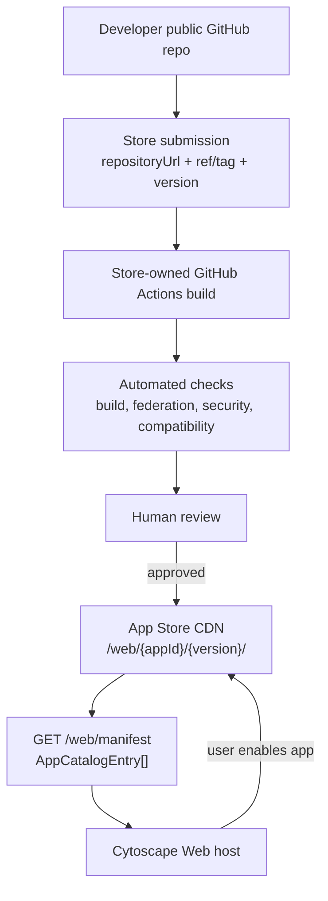
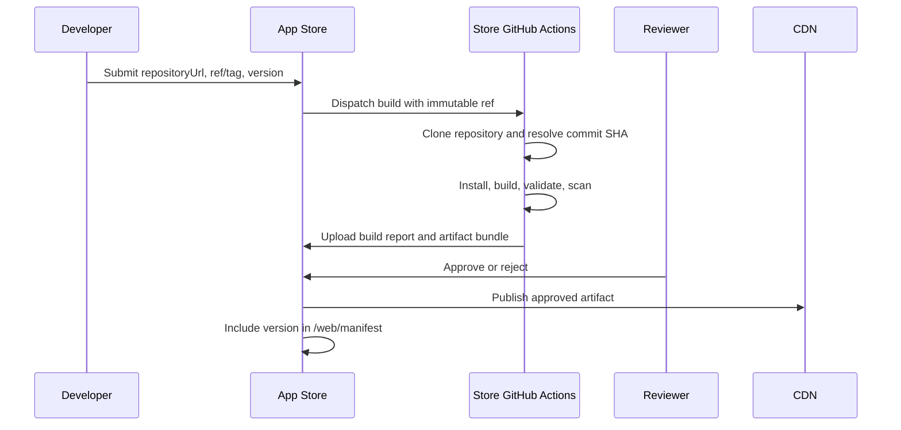
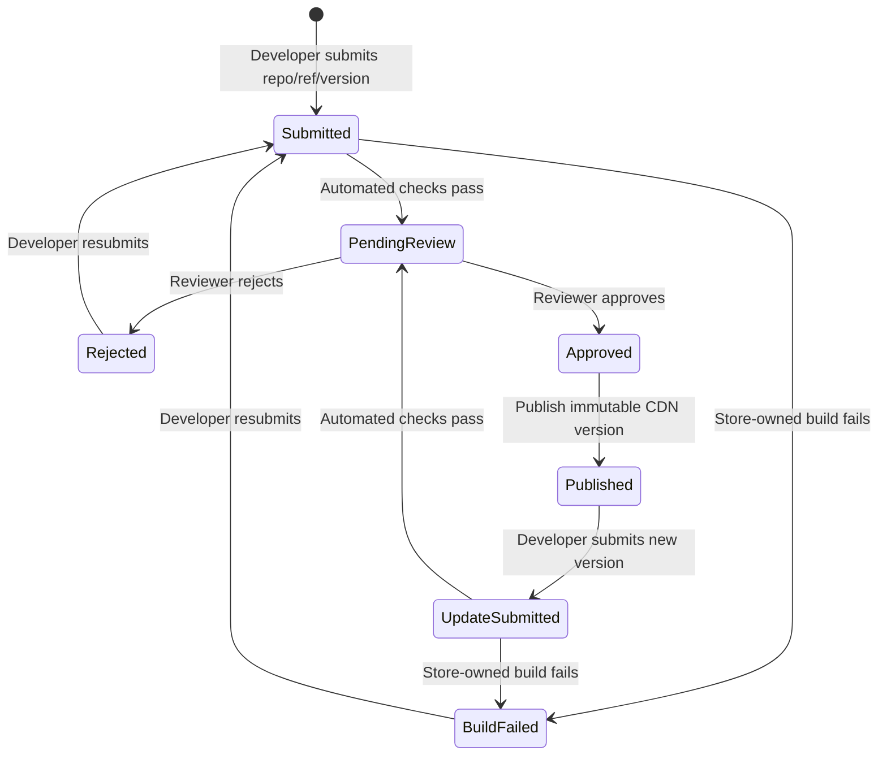

# Cytoscape App Store - Web App Extension Design

> **Status: Design Proposal / Future Work**
>
> This document describes how the existing Cytoscape App Store can be extended
> to accept **Cytoscape Web apps** in addition to existing Cytoscape Desktop
> apps. The App Store itself is an external service and is not implemented in
> this repository.
>
> Cytoscape Web host behavior is intentionally unchanged. The App Store
> publishes a runtime manifest in the existing `AppCatalogEntry[]` shape, and
> Cytoscape Web consumes it through the existing `obtainCatalogEntries()`
> pipeline.

- Rev. 3 (6/9/2026): Keiichiro ONO and Claude (Fable 5) - Add per-app
  single-entry install manifest endpoints (§9.1) consumed by the host's
  install intent and App Manager Install from URL
- Rev. 2 (5/21/2026): Keiichiro ONO and Codex - Recast as a Desktop App Store
  platform extension with Store-owned GitHub Actions builds
- Rev. 1 (3/20/2026): Keiichiro ONO and Claude - Initial brainstorming

---

## TL;DR

- **Extend the existing Desktop App Store.** Desktop JAR distribution remains
  intact. Web apps become a second platform/artifact type in the same App Store
  ecosystem.
- **Store-owned builds from GitHub.** Developers submit a public GitHub
  repository URL plus an immutable ref or tag. The App Store's own GitHub
  Actions workflow clones, builds, validates, and packages the app.
- **Managed CDN publishing.** Reviewed web bundles are served from
  `https://apps.cytoscape.org/web/{appId}/{version}/` so the code that was
  reviewed is the code users load.
- **Host contract stays stable.** Cytoscape Web reads `GET /web/manifest`,
  receives `AppCatalogEntry[]`, and loads selected apps dynamically via Module
  Federation. No App Store-specific host code is required.
- **Human review is mandatory.** Automated checks reduce reviewer burden, but
  every initial submission and update needs explicit core-team approval before
  CDN publication.
- **Internal Store metadata is not host metadata.** Build reports, checksums,
  commit SHAs, review state, and scanner output stay in the App Store backend;
  the Cytoscape Web manifest exposes only runtime fields.

---

## 1. Context

Phase 4 of the Module Federation design (see
[runtime-app-registration-specification.md](runtime-app-registration-specification.md))
introduces runtime app registration. The host fetches a manifest at startup,
shows a catalog in the app manager UI, and dynamically loads only selected apps
by injecting each app's `remoteEntry.js`.

The host-side manifest contract already exists:

- `AppCatalogEntry.id` is the Module Federation scope and must match
  `CyApp.id`
- `AppCatalogEntry.url` points to the app's `remoteEntry.js`
- `obtainCatalogEntries()` resolves the default URL, custom URL, or uploaded
  inline manifest
- `parseManifest()` validates and normalizes the manifest before storing it in
  `AppStore.catalog`

The current default manifest URL is `/apps.json`; once the App Store web
catalog is deployed, `DEFAULT_MANIFEST_URL` can point at the official App Store
manifest endpoint.

The existing Cytoscape Desktop App Store at <https://apps.cytoscape.org/>
already provides a public catalog for Desktop apps. This design extends that
store so that it can also publish Cytoscape Web apps. The distribution model is
different: Desktop apps are downloadable JAR files, while Web apps are
JavaScript Module Federation remotes served from a controlled CDN.

## 2. Goals

1. Let third-party developers submit Cytoscape Web apps using a public GitHub
   repository URL and immutable version ref
2. Build Web app bundles in App Store-owned GitHub Actions, not developer-owned
   release workflows
3. Preserve the existing Desktop App Store and add Web as a second platform
4. Publish a `GET /web/manifest` endpoint that Cytoscape Web can consume
   directly
5. Host reviewed Web bundles on an App Store-controlled CDN
6. Require human review before every Web app release is published
7. Keep App Store implementation choices separate from Cytoscape Web host code

## 3. Non-Goals

- No backend implementation in this repository
- No change to Cytoscape Web's App API, app manager, or Module Federation
  loader contract
- No replacement of Desktop App Store JAR submission or download behavior
- No private or organization-scoped Web apps in the first design
- No automatic publication from developer-owned release assets
- No guarantee that the first App Store implementation will include runtime
  sandboxing beyond current host behavior

## 4. Platform Model

The App Store should model Desktop and Web as platform-specific release types
under a shared catalog identity.

| Concern | Desktop App | Web App |
| --- | --- | --- |
| Runtime | Cytoscape Desktop JVM | Cytoscape Web browser host |
| Artifact | JAR file | `remoteEntry.js` plus chunks/assets |
| Install/load | Download/install locally | User enables app; host loads remote URL |
| Hosting | App Store hosts downloadable JARs | App Store CDN hosts immutable bundle dirs |
| Compatibility | Cytoscape Desktop versions | Cytoscape Web/App API versions |
| Store metric | Download count | Activation/load count |
| Support link | Existing Desktop support channels | GitHub Issues on source repository |

Desktop entries remain unaffected. Web-specific metadata and artifacts are
added alongside existing Desktop data rather than changing the Desktop
distribution model.

## 5. Hosting Model: Managed CDN

Two Web hosting models were evaluated:

| Model | Description | Pros | Cons |
| --- | --- | --- | --- |
| URL registry | Store records metadata and developer-hosted URLs | Minimal infrastructure | Reviewed code can be replaced after approval |
| Managed CDN | Store builds/copies reviewed bundles to its own CDN | Reviewed code is immutable and stable | Requires build, storage, and publish pipeline |

**Decision: Managed CDN.** If Web bundles are served from arbitrary external
URLs, a developer or compromised host can replace reviewed code without another
review. The App Store must control the final serving URL for published Web app
versions.

Published URLs are versioned and immutable:

```text
https://apps.cytoscape.org/web/{appId}/{version}/remoteEntry.js
https://apps.cytoscape.org/web/{appId}/{version}/chunks/*.js
https://apps.cytoscape.org/web/{appId}/{version}/assets/*
https://apps.cytoscape.org/web/{appId}/{version}/manifest.json
```

One additional unversioned path exists per app — a mutable pointer that always
describes the latest published version (see §9.1):

```text
https://apps.cytoscape.org/web/{appId}/manifest.json
```

Reusing an already published `{appId, version}` is rejected. Updates require a
new version submission.

## 6. End-to-End Architecture


```mermaid
flowchart TD
    DevRepo["Developer public GitHub repo"]
    Submission["Store submission<br/>repositoryUrl + ref/tag + version"]
    Build["Store-owned GitHub Actions build"]
    Checks["Automated checks<br/>build, federation, security, compatibility"]
    Review["Human review"]
    CDN["App Store CDN<br/>/web/{appId}/{version}/"]
    Manifest["GET /web/manifest<br/>AppCatalogEntry[]"]
    Host["Cytoscape Web host"]

    DevRepo --> Submission
    Submission --> Build
    Build --> Checks
    Checks --> Review
    Review -->|approved| CDN
    CDN --> Manifest
    Manifest --> Host
    Host -->|user enables app| CDN
```

**App Store components:**

| Layer | Responsibilities |
| --- | --- |
| Public catalog | Combined Desktop/Web search, app detail pages, ratings, metrics |
| Developer portal | Web app submission form, build status, review feedback |
| Review dashboard | Automated report review, approval/rejection, publish action |
| Store API | Submission records, release records, manifest generation |
| GitHub Actions | Store-owned clone/build/validation jobs |
| CDN/storage | Immutable Web bundle hosting |

The build and publish steps are deliberately separate. The build job has no
production deploy credentials. CDN publishing runs only after human approval.

## 7. Web Submission Contract

Developers submit a Web app version through the App Store UI or API with:

| Field | Required | Notes |
| --- | --- | --- |
| `repositoryUrl` | Yes | Public GitHub repository URL |
| `ref` or `tag` | Yes | Immutable commit SHA preferred; tags are resolved to commit SHA |
| `version` | Yes | Requested published app version |
| `app-store.json` | Recommended | Cytoscape Web metadata and build hints |

The submitted repository must satisfy these runtime requirements:

- It builds a Module Federation remote containing `remoteEntry.js`
- It exposes `./AppConfig`
- The default export from `./AppConfig` conforms to `CyAppWithLifecycle` or the
  base `CyApp` shape
- `CyApp.id === manifest.id === Module Federation scope`
- The app uses `@cytoscape-web/api-types` for public types
- New app code uses public `cyweb/*Api` modules or `AppContext.apis`
- Deprecated raw store exposes are not used by default; any raw store import in
  a new Store submission is a review warning and requires explicit reviewer
  acceptance

### 7.1 `app-store.json`

`app-store.json` is an optional repository file for Store-specific metadata.
It supplements `package.json`, `README.md`, `LICENSE`, and GitHub Topics.

```json
{
  "id": "myApp",
  "name": "My Cytoscape Web App",
  "description": "Network analysis tools for Cytoscape Web.",
  "icon": "./assets/icon.png",
  "tags": ["network-analysis", "clustering"],
  "compatibleHostVersions": ">=1.0.0",
  "federationName": "myApp",
  "exposedModule": "./AppConfig",
  "build": {
    "installCommand": "npm ci",
    "buildCommand": "npm run build",
    "outputDir": "dist"
  }
}
```

Current host constraints:

- `federationName` must equal `id`
- `exposedModule` must be `./AppConfig`
- `id` must match the JavaScript identifier pattern accepted by
  `parseManifest()`: `/^[a-zA-Z_$][a-zA-Z0-9_$]*$/`
- `name` is display-only and may contain spaces or Unicode

If `app-store.json` is absent, the Store can infer metadata from
`package.json`, repository metadata, and reviewer input, but it still must
derive a valid `id`, build command, and output directory.

### 7.2 Metadata Extraction

The App Store can reduce manual entry by extracting:

| Source | Extracted fields |
| --- | --- |
| `app-store.json` | `id`, display metadata, compatibility, build hints |
| `package.json` | `name`, `version`, `description`, `license`, `author` |
| `README.md` | Store page description |
| `LICENSE` | License text/type |
| GitHub Topics | Tags/categories |
| GitHub API | Contributors, last commit date, open issues, archived state |

Reviewer-approved values become Store records. Generated Cytoscape Web
manifests are projections from those records, not raw repository files.

## 8. Store-Owned Build Pipeline

The App Store owns the build workflow for Web apps. It must not depend on
developer-owned GitHub Actions workflows or developer-uploaded release assets
for publication.


```mermaid
sequenceDiagram
    participant Dev as Developer
    participant Store as App Store
    participant Actions as Store GitHub Actions
    participant Review as Reviewer
    participant CDN as CDN

    Dev->>Store: Submit repositoryUrl, ref/tag, version
    Store->>Actions: Dispatch build with immutable ref
    Actions->>Actions: Clone repository and resolve commit SHA
    Actions->>Actions: Install, build, validate, scan
    Actions->>Store: Upload build report and artifact bundle
    Review->>Store: Approve or reject
    Store->>CDN: Publish approved artifact
    Store->>Store: Include version in /web/manifest
```

### 8.1 Build Steps

The Store-owned workflow should:

1. Validate that `repositoryUrl` is a public GitHub URL
2. Resolve the submitted `ref` or `tag` to a commit SHA and record it
3. Check out exactly that commit
4. Install dependencies with the configured command, preferably lockfile-based
5. Run the configured build command
6. Locate `remoteEntry.js` in the output directory
7. Copy `remoteEntry.js`, chunks, and static assets into a staging artifact
8. Run automated compatibility and security checks
9. Produce a build report for reviewers

### 8.2 Build Artifact Contract

A successful build produces:

- `remoteEntry.js`
- all chunks and assets required by that remote
- a manifest of artifact files and checksums
- a build report containing:
  - repository URL
  - resolved commit SHA
  - submitted ref/tag
  - requested version
  - lockfile hash
  - output file list and checksums
  - bundle size summary
  - dependency/security scan output
  - Module Federation compatibility result
  - dangerous API and network-domain scan results

The staged artifact is not public until a reviewer approves publication.

## 9. Manifest Integration

The App Store's Web manifest endpoint returns an array of `AppCatalogEntry`
objects as defined in the runtime app registration specification.

```http
GET https://apps.cytoscape.org/web/manifest
Content-Type: application/json
```

```json
[
  {
    "id": "hello",
    "name": "Hello World",
    "url": "https://apps.cytoscape.org/web/hello/1.2.0/remoteEntry.js",
    "author": "Cytoscape Team",
    "description": "A simple hello world app",
    "version": "1.2.0",
    "tags": ["demo", "getting-started"],
    "icon": "https://apps.cytoscape.org/icons/hello.png",
    "license": "MIT",
    "repository": "https://github.com/cytoscape/cytoscape-web-app-examples",
    "compatibleHostVersions": ">=1.0.0",
    "dependencies": []
  }
]
```

Required runtime fields:

- `id`
- `url`
- `author`

Optional runtime fields:

- `name`
- `description`
- `version`
- `tags`
- `icon`
- `license`
- `repository`
- `compatibleHostVersions`
- `dependencies`

The Store backend may store richer records, but only the runtime manifest fields
above are returned to Cytoscape Web. Internal metadata such as commit SHA,
review state, build logs, checksums, scanner results, and reviewer notes stays
inside the App Store.

### 9.1 Per-app install manifest

The host-side install intent (`?installApp=<manifestUrl>`) and the App
Manager's manual **Install from URL** action (see
[workspace-app-install-design.md](./workspace-app-install-design.md) §7.2 and
§12.8) consume a **single-entry manifest** describing one app. For every app
with at least one published Web version, the Store publishes:

```http
GET https://apps.cytoscape.org/web/{appId}/manifest.json
```

a **one-element** `AppCatalogEntry[]` array (same schema as `/web/manifest`)
describing the latest published version. An immutable per-version variant is
published alongside each release:

```http
GET https://apps.cytoscape.org/web/{appId}/{version}/manifest.json
```

The App Store **Install** button links to Cytoscape Web with the
latest-version manifest URL as the install intent. Returning an array rather
than a bare object lets the host reuse `parseManifest()` unchanged.

## 10. Internal Store Schema Boundary

The App Store should use a Desktop/Web superset internally. A conceptual record
shape is:

```typescript
interface StoreAppRecord {
  id: string
  name: string
  platforms: Array<'desktop' | 'web'>
  desktop?: {
    jarReleases: DesktopRelease[]
  }
  web?: {
    publishedVersions: WebRelease[]
    repositoryUrl: string
  }
}

interface WebRelease {
  appId: string
  version: string
  repositoryUrl: string
  submittedRef: string
  commitSha: string
  cdnBaseUrl: string
  remoteEntryUrl: string
  artifactChecksums: Record<string, string>
  buildReportId: string
  reviewStatus: 'pending' | 'approved' | 'rejected'
}
```

This is not a required backend implementation. It documents the boundary:
Store records may be rich, but `GET /web/manifest` is a stable projection into
`AppCatalogEntry[]`.

## 11. Review Policy

All initial submissions and updates go through two stages:

1. **Automated review** - schema validation, build verification, Module
   Federation compatibility, security/dependency scans, and risk reports
2. **Human review** - a core team member approves or rejects the version

No Web app version is published to the CDN without explicit human approval.
There is no auto-approve path for patch, minor, or update releases.

### 11.1 Automated Checks

Automated review should include:

- Repository/ref validation
- Install and build success
- `remoteEntry.js` existence
- `./AppConfig` load test
- `CyApp.id`, manifest `id`, and Module Federation scope match
- React, ReactDOM, and MUI shared dependency compatibility
- `@cytoscape-web/api-types` availability and version report
- Public App API usage scan
- Deprecated raw store expose usage scan
- Bundle size report and large-increase warning
- Dependency vulnerability scan
- License report
- Detection/reporting for:
  - `eval()` or `Function()`
  - direct `innerHTML` assignment
  - `document.cookie`
  - `localStorage` or `sessionStorage`
  - new `fetch()` or `XMLHttpRequest` domains

These checks can block publication when they fail hard requirements such as
build success or app identity matching. Risk flags that require judgment are
surfaced to human reviewers.

### 11.2 Human Review Focus

Reviewers should inspect:

- App purpose and user-facing behavior
- Requested permissions or API usage
- New network domains
- DOM manipulation outside plugin-controlled resources
- Lifecycle cleanup in `mount()` and `unmount()`
- Bundle size changes
- License compatibility
- Any raw store import or deprecated Module Federation expose usage

## 12. App Lifecycle


```mermaid
stateDiagram-v2
    [*] --> Submitted: Developer submits repo/ref/version
    Submitted --> BuildFailed: Store-owned build fails
    Submitted --> PendingReview: Automated checks pass
    BuildFailed --> Submitted: Developer resubmits
    PendingReview --> Rejected: Reviewer rejects
    Rejected --> Submitted: Developer resubmits
    PendingReview --> Approved: Reviewer approves
    Approved --> Published: Publish immutable CDN version
    Published --> UpdateSubmitted: Developer submits new version
    UpdateSubmitted --> BuildFailed: Store-owned build fails
    UpdateSubmitted --> PendingReview: Automated checks pass
```

Published versions remain immutable. Rejection or build failure never updates
`/web/manifest`.

## 13. App Detail Page

The shared public catalog can display platform-specific sections.

| Field | Source |
| --- | --- |
| Name, icon, description | Store record, `app-store.json`, `package.json` |
| Platform badges | Store record (`desktop`, `web`) |
| Web version history | Store Web release records |
| Desktop version history | Existing Desktop release records |
| License | `LICENSE`, `package.json`, reviewer-approved metadata |
| Tags/categories | `app-store.json`, GitHub Topics, reviewer edits |
| Repository link | GitHub URL |
| Last commit date | GitHub API |
| Open issues count | GitHub API |
| CI/build status | Store-owned build report |
| Security status | Dependency/advisory scan report |
| Bundle size | Measured at Store build time |
| Desktop download count | Existing App Store metric |
| Web activation count | Web host reporting or CDN/manifest telemetry |
| Rating | Existing rating system, scoped clearly by platform if needed |

Issue links can point directly to the developer repository:

- "Report a Bug" -> `https://github.com/{owner}/{repo}/issues/new`
- "Request a Feature" -> `https://github.com/{owner}/{repo}/issues/new`

## 14. Repository Health Monitoring

The App Store can periodically check registered Web app repositories for:

- **Stale repository** - no commits for an extended period; show warning
- **Archived repository** - GitHub reports the repo as archived; mark app as
  unmaintained
- **Security advisory** - dependency vulnerability appears; notify developer
  and display a warning
- **Deleted or unavailable repository** - keep published immutable versions,
  but block new submissions until the source is restored or reviewed

Critical unresolved security issues may lead to manual unpublishing, but that
policy should be explicit and reviewer-driven.

## 15. Security Considerations

### 15.1 Build and Publish Separation

- Store-owned build jobs run without production CDN deploy credentials
- Build artifacts are staged privately with checksums
- CDN publish requires approval and a separate publish job
- Publish jobs copy only the approved staged artifact for the approved
  `{appId, version}`

### 15.2 Bundle Integrity

- Published CDN directories are immutable
- CORS headers allow Cytoscape Web origins to fetch remote bundles
- Artifact checksums are retained in Store records
- Subresource Integrity hashes may be exposed in a future host manifest
  extension, but they are not part of the current `AppCatalogEntry` contract

### 15.3 Runtime Trust Boundary

Loading a Module Federation remote executes third-party JavaScript in the
browser context. Review and Store-owned builds reduce supply-chain risk but do
not create a full sandbox.

Potential future runtime defenses:

- Content Security Policy allowlisting for Store CDN and known API endpoints
- API proxy/capability filtering around `AppContext.apis`
- DOM containment for plugin resources
- Network request monitoring for app contexts
- Manifest signing or SRI support

Those defenses are compatible with this Store design but are not required for
the first documentation update.

## 16. Acceptance Scenarios

- A valid public GitHub repo and tag builds successfully, passes review,
  publishes to `https://apps.cytoscape.org/web/{appId}/{version}/`, and appears
  in `GET /web/manifest`
- A repo that fails to produce `remoteEntry.js` is not publishable
- A remote that does not expose `./AppConfig` is not publishable
- A remote whose exported `CyApp.id` does not match the submitted Store app id
  is not publishable
- Build failure or security scan failure keeps the submission unpublished and
  does not update `/web/manifest`
- Reusing an already published `{appId, version}` is rejected
- Desktop app entries and JAR download behavior remain unaffected
- Cytoscape Web can load the generated manifest with the current
  `parseManifest()` and `obtainCatalogEntries()` behavior
- Every published app exposes `/web/{appId}/manifest.json` (latest) and
  `/web/{appId}/{version}/manifest.json` (immutable), each a one-element
  `AppCatalogEntry[]` consumable by `parseManifest()` (§9.1)

## 17. Open Questions

1. **Activation tracking** - Should Web activation counts come from an explicit
   Cytoscape Web telemetry API, CDN logs, or manifest fetch/load events?
2. **CDN provider** - Which storage/CDN backend should host immutable Web
   bundles?
3. **SRI and signing** - Should future `AppCatalogEntry` extensions include
   SRI hashes or signatures?
4. **Unpublish policy** - What severity of security issue warrants removing a
   published Web version from the manifest?
5. **Version negotiation** - Should `GET /web/manifest?hostVersion=...` filter
   incompatible apps server-side, or should the host continue to filter locally?
6. **Private apps** - Should organization-scoped Web apps be supported later?
