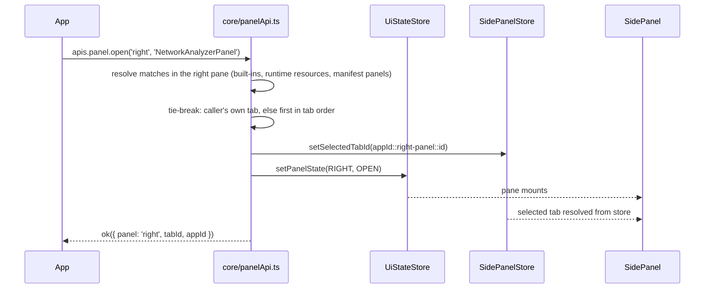

# Panel API — open and select a workspace tab from an App

> Status: **implemented** (2026-09-21, #740). Behavioral reference:
> `src/app-api/api_docs/Api.md` (PanelApi). The sections below keep the
> analysis and the decisions; "Implementation notes" records where the code
> departed from the plan.

## Overview

A new App API domain, `panel`, that lets an App (plugin) or any
`window.CyWebApi` consumer open one of the workspace's collapsible panes (left,
right, bottom) and select a tab inside it. The caller names the pane and the
tab id; if the pane is closed, the host opens it first.

## Context

The Network Analyzer App (`network-analyzer-cw`) registers a tab in the
`'right-panel'` slot with the id `'NetworkAnalyzerPanel'`, and an
`'apps-menu'` item, `'Analyze Network'`, that runs an analysis. When the
analysis finishes, the results tab may not be visible: the right pane may be
closed, or another tab may be selected. A new user has no cue that the action
produced a tab at all.

Every App tab already carries an `id`, so the host can locate the tab and
select it, opening the parent pane when needed.

### Requirements

- An App can open/select any tab inside the left, right and bottom collapsible
  panes (`Allotment.Pane`) of `src/features/Workspace/WorkspaceEditor.tsx`.
- The caller passes the parent pane (`'left' | 'right' | 'bottom'`) together
  with the tab id, and the host looks for matches **in that pane only**.
- Ids are **not guaranteed unique**. If several tabs in that pane share the id,
  the host selects the one registered by the calling App, otherwise the first
  match in tab order.

> An earlier draft took the tab id alone and selected every match in every
> pane. It was dropped: a tab strip can show only one selected tab, so "select
> all" still needed a tie-break inside a pane, and an App id that happened to
> collide with a built-in id would have opened an unrelated pane.

## Feasibility

Feasible, and the change is small. Opening a pane and selecting a left or
bottom tab already go through a store, so the framework-agnostic core layer can
drive them. The one real blocker is that the right panel's selected tab lives
in React component state and cannot be reached from the App API today.

### What exists today

| Pane   | Open/closed state                      | Selected tab                                                   | Tab ids                                                                                                                  |
| ------ | -------------------------------------- | -------------------------------------------------------------- | ------------------------------------------------------------------------------------------------------------------------ |
| Left   | `ui.panels.left` via `setPanelState`   | `ui.networkBrowserPanelUi.activeTabIndex` in `UiStateStore`    | None. Tabs are numeric indexes, and `LLM QUERY` (index 2) only exists for HCX networks.                                  |
| Bottom | `ui.panels.bottom` via `setPanelState` | `ui.tableUi.activeTabIndex` in `UiStateStore`                  | None. Tabs come from the `TableBrowserTab` enum (0/1/2).                                                                 |
| Right  | `ui.panels.right` via `setPanelState`  | `useState` in `src/features/Workspace/SidePanel/SidePanel.tsx` | String ids of the form `${appId}::right-panel::${id}`, plus one built-in `__builtin__::right-panel::sub-network-viewer`. |

- **Opening a pane.**
  `useUiStateStore.getState().setPanelState(panel, PanelState.OPEN)` already
  works from core. The onboarding tour
  (`src/features/Onboarding/utils/tourActions.ts`) and the hierarchy viewer
  call it this way. Like the tab-index setters, it does not persist — a pane
  the user opens by hand is not persisted either, so the API behaves exactly
  like the click it stands in for. Going through the setters (never a raw
  `setState` on `UiStateStore`) follows `.serena/memories/lessons.md`.
- **Left and bottom tabs.** Store-backed, so core can select them with
  `setActiveNetworkBrowserPanelIndex` and `setActiveTableBrowserIndex`. They
  lack public string ids, so a small id-to-index registry is needed.
- **Right tab (the blocker).**
  - The selection lives in `SidePanel`'s local `useState`.
  - `SidePanel` is unmounted while the right pane is closed
    (`{panels.right === PanelState.OPEN && ...}` in `WorkspaceEditor.tsx`), so
    nothing is listening for a request either.
  - The selection must move into a store. It is already keyed by a string id,
    so the component change is small.
- **Partial workaround available today.** An App can import
  `cyweb/UiStateStore` and open the right pane itself. It still cannot select
  its tab, which confirms the gap.
- **App tabs exist only in the right pane.** `'left-panel'` and
  `'bottom-panel'` are reserved slot names in
  `src/app-api/types/AppResourceTypes.ts`, not implemented ones.

## Design

### Proposed API

```ts
// CyWebApi.panel / apis.panel / usePanelApi()
type PanelId = 'left' | 'right' | 'bottom' // same values as models/UiModel/Panel

interface PanelApi {
  /**
   * Opens `panel` and, when `tabId` is given, selects the visible tab with
   * that id inside it. Omit `tabId` to only open the pane.
   */
  open(
    panel: PanelId,
    tabId?: string,
  ): ApiResult<{ panel: PanelId; tabId?: string; appId?: string }>
}

// Network Analyzer, once an analysis completes:
apis.panel.open('right', 'NetworkAnalyzerPanel')
```

- Returns `INVALID_INPUT` for an unknown pane or an empty `tabId`, and
  `RESOURCE_NOT_FOUND` when no visible tab in that pane matches — in which case
  the pane is left as it was. Never throws across the API boundary.
- One call selects at most one tab, so the result is a single object; `appId`
  tells the caller which App's tab won when ids collide.
- Built-in public ids (`LeftPanelTabId`, `BottomPanelTabId`, `RightPanelTabId`
  in `src/models/UiModel/PanelTab.ts`):
  - Left: `workspace`, `style`, `llm-query`
  - Bottom: `nodes`, `edges`, `network`
  - Right: `sub-network-viewer`
- The pane scopes the id, so built-in ids can stay short, and an App id can
  only collide with a built-in id of the same pane. Built-in tabs come first in
  tab order, so the built-in wins unless the caller owns the other tab.

### Data flow



### Key decisions

1. **The pane is a required argument; duplicates are resolved inside it.**
   - An App writer already knows the pane — it is the slot they registered in
     (`'right-panel'` → `'right'`) — so the extra argument costs nothing and
     makes the call deterministic: one call, at most one tab, no unrelated
     pane opening.
   - Two Apps registering the same id in one pane: the calling App's own tab
     wins, otherwise the first match in tab order. "Calling App" is only known
     through the per-App API (`createPanelApi(appId)`); an anonymous
     `window.CyWebApi` caller always gets the first match.
   - Pane values are `'left' | 'right' | 'bottom'`, matching the `Panel` model
     and the `?left=` / `?right=` / `?bottom=` URL parameters, rather than slot
     names — built-in tabs are not slot resources.
2. **Where the API lives.** `resource.openModal` is scoped per App and only
   finds the caller's own resources. This API must reach built-in tabs and other
   Apps' tabs, so it is a new `panel` domain on the anonymous `CyWebApi`. Apps
   get it through the `...CyWebApi` spread in `src/app-api/core/perAppApis.ts`;
   a per-App override (`createPanelApi(appId)`) supplies the tie-break above.
3. **Tabs that are currently hidden do not count as a match.** A tab can be
   filtered out (`requires.network` unmet, inactive App, `LLM QUERY` on a
   non-HCX network).
   - `SidePanel` has an effect that resets the selection to the first tab when
     the selected entry disappears. It is kept as it was: the API resolves tabs
     from the same stores, through the same model function, that the strip
     renders from, so it never stores an id the strip is not showing and the
     effect never fires against an API selection.
4. **The right-tab selection is not persisted.** It is not persisted today, so
   a small non-persisted store (the `ModalLauncherStore` precedent) is no
   regression. It also avoids the per-tab-state vs. shared-IndexedDB-row problem
   recorded in the lessons file, which adding the field to `ui` would have to
   handle.
5. **No side effects beyond showing the tab.** Clicking the Sub Network Viewer
   tab also calls `setActiveNetworkView`. A programmatic select does not — the
   API call is only a request to show the tab.

## Implementation plan

1. **Shared tab identity** in `src/models/UiModel/`:
   - Built-in tab id constants.
   - Id-to-index maps for the left and bottom panes.
   - Move the `${appId}::right-panel::${id}` builder out of
     `src/features/Workspace/SidePanel/TabContents.tsx` so core and the feature
     share it.
2. **Store:** a small non-persisted store (model interface plus store, following
   `docs/specifications/STORE_CREATION_PATTERN.md`) holding
   `selectedRightPanelTabId` and a setter.
3. **`SidePanel` refactor:**
   - Read and write the selection through the new store instead of `useState`.
   - Failing spec first: select while the pane is closed, open the pane, and the
     tab is selected.
4. **Core** `src/app-api/core/panelApi.ts`, React-free and built on
   `getState()`:
   - Resolve matches inside the requested pane: its built-in tabs and, for the
     right pane, active Apps' `'right-panel'` resources and manifest `Panel`
     components.
   - Apply the tie-break, then call `setPanelState(panel, OPEN)` and the pane's
     tab setter.
   - Add `createPanelApi(appId)` for the tie-break and wire it into
     `buildPerAppApis` and `CyWebApiType`.
   - Unit tests: happy path per pane, pane-only open, same id in another pane
     is ignored, tie-break (own tab / first match / anonymous caller), hidden
     tab, unknown pane, empty id, not found.
5. **Public surface:**
   - `src/app-api/usePanelApi.ts` hook and its test.
   - `./PanelApi` in `src/app-api/federation/federationExposes.ts` and its
     contract test.
   - Types in `src/app-api/types`.
   - `packages/api-types`, including the changelog.
   - `src/app-api/api_docs/Api.md`.
6. **Verify:** `npm run test:checks:quiet`, plus one targeted e2e spec that
   calls `window.CyWebApi.panel.open('right', ...)` with the right pane closed.
7. **`network-analyzer-cw`:** call
   `apis.panel?.open('right', 'NetworkAnalyzerPanel')`
   when an analysis completes, in the analyzer modal's success path.
   - The `'apps-menu'` `onClick` only opens the form, so it is the wrong place
     for the call.
   - The optional chaining keeps the App working on older hosts.

Steps 1–4 are the real work. Step 3 is the only one that changes existing
behavior; everything else is additive.

## Implementation notes

What was built, where it differs from the plan above:

- **Model** — `src/models/UiModel/PanelTab.ts` (built-in id constants, the
  `PanelTab` shape) and `src/models/UiModel/impl/panelTabs.ts`
  (`listLeftPanelTabs`, `listBottomPanelTabs`, `listRightPanelAppTabs`,
  `listRightPanelTabs`, `pickPanelTab`, `rightPanelResourceId`). The right
  pane's visibility filter, manifest/runtime merge and `order` sort moved here
  out of `TabContents.tsx`, which now only attaches components.
- **Store** — `SidePanelStore` (`selectedTabId`, `setSelectedTabId`),
  non-persisted, zustand only.
- **`SidePanel`** — reads and writes the selection through the store. The
  reset-to-first effect is unchanged (key decision 3).
- **Core** — `src/app-api/core/panelApi.ts`: `createPanelApi(appId?)` and the
  anonymous `panelApi`. It resolves the tab before touching any store, selects
  it, then opens the pane.
- **`isHCX`** — the left pane's `'llm-query'` tab exists only for a hierarchy
  network, and that predicate lives in `features/HierarchyViewer/utils/`.
  `panelApi.ts` imports it: it is a pure function with no React or heavy
  runtime imports, and models must not know what a hierarchy is. This is the
  one `features/` import in `core/`, recorded as principle 18 in
  `src/app-api/AGENTS.md`.
- **Hook** — `usePanelApi()` returns the calling app's instance inside
  `AppIdProvider` and the anonymous one outside it, unlike the domain hooks
  that always return the shared core object.
- **E2E** — `test/playwright/panel-api.spec.ts`, against the fixture remote
  (`test/fixtures/remote-app/AppConfig.tsx`, menu item `show-appdata-panel`):
  an Apps menu action opens the closed side panel on the app's tab, which is
  the store-to-unmounted-component hand-off unit tests cannot reach.
- **Not done here** — the `network-analyzer-cw` call site (plan step 7).

## Open questions

- None open. Settled with the requester: the name is `panel.open`
  (`dialog.open` is the existing precedent; nothing in the API uses `show`); an
  explicit `appId` argument to target another App's tab, and a `panel:selected`
  event, are not needed for now.
