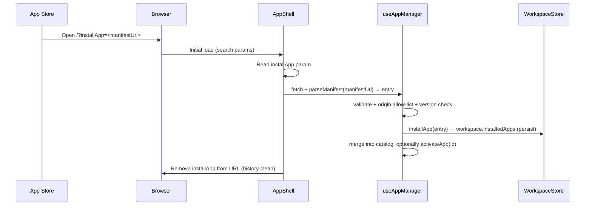
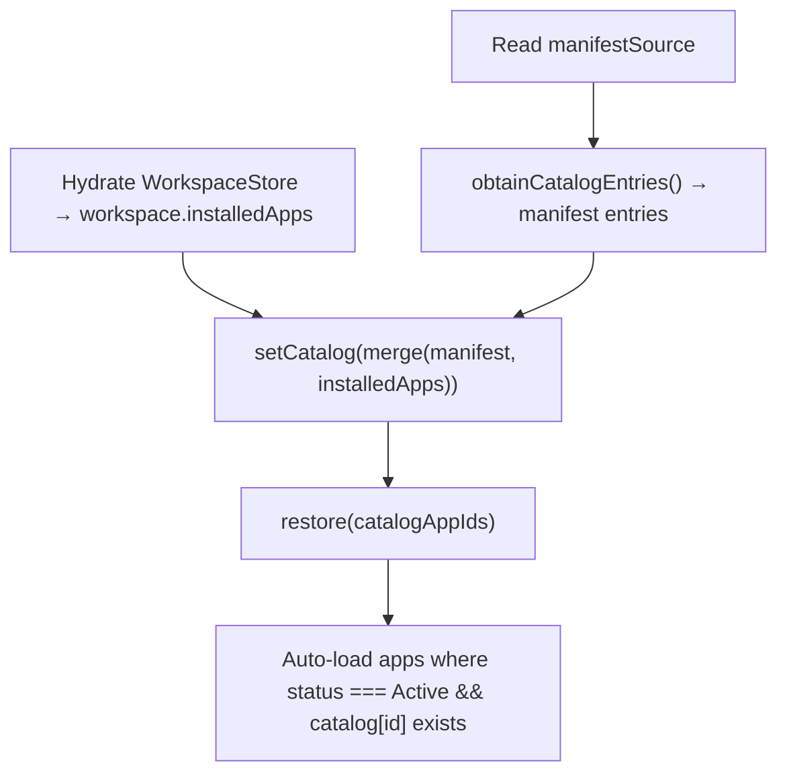

# Workspace-Scoped App Install & Persistence Design

> **Status: Design Proposal**
>
> This document specifies how Cytoscape Web persists App Store-installed apps in
> the user's workspace, restores them across sessions from both the manifest
> (`apps.json`) and IndexedDB, and prepares the installed-app set to travel with
> a future NDEx3 workspace snapshot.
>
> It builds on the runtime app registration model and the App Store extension
> design. The host's existing manifest pipeline (`obtainCatalogEntries()`,
> `parseManifest()`) and app lifecycle (`activateApp` → `loadRemoteApp` →
> `mountApp`) are reused; this design adds a persisted, workspace-scoped install
> layer on top.

- Rev. 2 (6/9/2026): Keiichiro ONO and Claude (Fable 5) — Document the existing
  NDEx workspace save/load path (§2.4) and rebuild §11 on top of it as Stage 1;
  add catalog re-merge rule (§8.2), hydration-gate hardening (§8.3), and the
  App Manager **Install from URL** entry point (§12.8)
- Rev. 1 (5/28/2026): Keiichiro ONO and Claude (Opus 4.8) — Initial design

### See Also

| Document | Defines |
| --- | --- |
| [runtime-app-registration-specification.md](./runtime-app-registration-specification.md) | Runtime catalog (`AppCatalogEntry`), `obtainCatalogEntries()`, app lifecycle and load states |
| [app-store-design.md](./app-store-design.md) | App Store Web extension, managed CDN, `GET /web/manifest` contract |
| [app-install-from-appstore.md](./app-install-from-appstore.md) | Install-intent transport options (postMessage / URL param / manifest update) |
| [app-api-specification.md](./app-api-specification.md) | Public App API surface and `ApiResult<T>` contract |

---

## 1. Overview

Today, the runtime catalog of available apps is rebuilt every session from the
manifest only (`apps.json` or a configured manifest source). The catalog entry
is the only place that carries the remote bundle URL (`AppCatalogEntry.url`);
the persisted per-app record (`CyApp`) stores status but **not** the URL.

As a result, an app that the user installs dynamically from the App Store —
which by definition is **not** listed in `apps.json` — cannot survive a reload:
its URL is lost, and it is excluded from both the restore pass and the startup
auto-load pass.

This design makes installed apps **first-class, workspace-scoped, persisted
state**:

1. The user clicks **Install** in the App Store. The app is added to the current
   workspace's installed-app list and (optionally) activated.
2. On reload, the available-app catalog is reconstructed as the **union of the
   manifest and the workspace's installed apps**, so App Store-installed apps
   restore correctly even when they are absent from `apps.json`.
3. The installed-app list lives inside the workspace, so it can be serialized
   as part of a future **workspace snapshot uploaded to NDEx3** and restored on
   any device.

This specification covers Module Federation apps only. Service Apps
(REST-based `ServiceApp`) are an independent mechanism and are unaffected.

### 1.1 Design Decisions

Two decisions are settled and drive the rest of this document:

- **Installed apps are stored in the Workspace** (`Workspace.installedApps`),
  persisted through `WorkspaceStore` to the `workspace` IndexedDB object store.
  This is the shortest path to workspace-snapshot/NDEx3 support. The current
  global `apps` object store is migrated and then deprecated.
- **The primary install transport is the URL-parameter install intent**
  (`?installApp=…`), consumed by `AppShell`. The `postMessage` bridge and a
  server-side per-user manifest are out of scope for the first implementation
  (see [app-install-from-appstore.md](./app-install-from-appstore.md)).

---

## 2. Current State

### 2.1 Where app data lives today

| Concept | Type / location | Persisted? |
| --- | --- | --- |
| Available app (carries `url`) | `catalog: Record<id, AppCatalogEntry>` in `AppStore` | **No** — re-fetched each session from the manifest |
| Registered app + status | `apps: Record<id, CyApp>` in `AppStore` (no `url`) | Yes — global `apps` store, keyed by app `id` only |
| Manifest source | `manifestSource` | Yes — `appSettings` key-value store |
| Runtime load state | `loadStates: Record<id, AppLoadState>` | No — session only |

`AppCatalogEntry` (`src/models/AppModel/AppCatalogEntry.ts`) carries
`{ id, url, author, name?, version?, tags?, icon?, license?, repository?,
compatibleHostVersions?, dependencies? }`. `CyApp`
(`src/models/AppModel/CyApp.ts`) carries `{ id, name, description?, version?,
components?, status? }` — **no URL**.

### 2.2 Startup sequence (`useAppManager` init)

1. Read `manifestSource` from IndexedDB.
2. `obtainCatalogEntries(manifestSource)` → fetch `apps.json` → `setCatalog()`.
3. `restore(catalogAppIds)` — restore persisted `CyApp` records **only for ids
   present in the catalog**.
4. Auto-load apps where `status === Active` **and** `catalog[id] !== undefined`,
   loading the remote from `catalog[id].url`.

`activateApp(id)` likewise requires `catalog[id]` to resolve the URL.

### 2.3 Snapshot

`exportDatabaseSnapshot()` dumps **all** IndexedDB object stores (including the
global `apps` and `serviceApps` tables) — it is not workspace-scoped.
`exportApplicationState()` additionally folds in full Zustand store states.

### 2.4 Existing NDEx workspace save/load

Saving a workspace to NDEx **already exists** and already carries app
information:

- `useSaveWorkspaceToNDEx` (`src/data/hooks/useSaveWorkspaceToNDEx.ts`) uploads
  the workspace to the NDEx v3 `workspaces` endpoint via
  `createNdexWorkspace` / `updateNdexWorkspace`
  (`src/data/external-api/ndex/workspace.ts`) with
  `options: { currentNetwork, activeApps: string[], serviceApps: string[] }`.
- `useLoadWorkspace` (`src/data/hooks/useLoadWorkspace.ts`) restores a remote
  workspace: it clears the local DB, writes the workspace record, applies
  `options.activeApps` to the persisted `CyApp` statuses, and reloads the page.
- The ndex-client `CyWebWorkspace` type has an open index signature
  (`[key: string]: any`), so `options` is extensible on the client side.

`options.activeApps` carries app **ids only** — no URL (P8). A restored
workspace can therefore only reactivate apps whose URL is resolvable from the
manifest, which is the NDEx-path twin of P1. §11 builds on this existing
pipeline instead of inventing a new one.

---

## 3. Problems

| # | Problem |
| --- | --- |
| P1 | **Catalog URL is never persisted.** It exists only in `apps.json`-derived entries. App Store-installed apps lose their `remoteEntry.js` URL on reload. |
| P2 | **No persisted "installed" concept.** The catalog (manifest-derived) and `apps` (registered + status) exist, but there is no durable source of truth for "apps the user chose to add." |
| P3 | **Install state is global, not per-workspace.** The `apps` store is keyed by app id only; the `Workspace` model has no app field. This conflicts with workspace-scoped restore and snapshotting. |
| P4 | **No install entry point.** There is no `installApp` command and no `AppShell` handler for an App Store install intent. |
| P5 | **Snapshot is whole-DB, not workspace-scoped.** A per-workspace NDEx3 snapshot must embed that workspace's installed apps (URL + metadata). |
| P6 | **No trust boundary for external entries.** Install and snapshot-restore can introduce arbitrary `remoteEntry.js` URLs (arbitrary third-party JS). Origin allow-listing and `compatibleHostVersions` enforcement are missing on these paths. |
| P7 | **No uninstall affordance.** The App Manager UI can enable/disable an app and remove a legacy *orphan*, but there is no way to uninstall a properly installed app from the workspace. Once dynamic install exists, removal is the natural counterpart. |
| P8 | **NDEx workspace save carries app ids only.** The existing NDEx save/load (§2.4) stores `options.activeApps: string[]` — no URL — so the NDEx restore path has the same URL-loss defect as P1: a restored workspace can only reactivate manifest-listed apps. |

---

## 4. Goals

1. Let a user install a Cytoscape Web app from the App Store via a single
   **Install** action, adding it to the current workspace.
2. Persist installed apps **per workspace** so the available-app catalog
   restores as **`manifest ∪ workspace.installedApps`** across sessions.
3. Keep **install distinct from activation**: installing adds the app to the
   catalog; the remote bundle is loaded and executed only when the user (or a
   restored Active status) enables it.
4. Make the installed-app set serializable so it can ride along with a future
   **workspace snapshot to NDEx3** and restore on another device.
5. Validate every externally supplied entry through the existing manifest
   validation, plus an origin allow-list and host-version compatibility check.
6. Reuse the existing lifecycle (`restore` → auto-load → `activateApp` →
   `loadRemoteApp` → `mountApp`) with minimal change.
7. Provide an **uninstall** affordance in the App Manager UI for
   workspace-installed apps, distinct from disable, with confirmation.
8. Provide a manual **Install from URL** entry point in the App Manager UI
   that reuses the same validated install pipeline (§12.8).

---

## 5. Non-Goals

- No App Store backend implementation, and no server-side per-user install
  manifest in the first version.
- No `postMessage` install bridge in the first version (kept compatible for
  later — see §7.4).
- No change to the App API surface, the Module Federation loader contract, or
  Service App behavior.
- No runtime sandbox beyond current host behavior; review and managed-CDN
  immutability remain the primary supply-chain defenses
  (see [app-store-design.md](./app-store-design.md) §15).
- No multi-source manifest merging beyond `manifest ∪ workspace.installedApps`.

---

## 6. Data Model

### 6.1 `InstalledApp`

A new persisted record wraps the catalog entry (so the URL travels with the
workspace) plus activation status and provenance.

```typescript
// src/models/AppModel/InstalledApp.ts
import { AppCatalogEntry } from './AppCatalogEntry'
import { AppStatus } from './AppStatus'

export type AppSource = 'manifest' | 'appstore' | 'snapshot'

export interface InstalledApp {
  /** Full catalog entry, including the immutable versioned remoteEntry URL */
  entry: AppCatalogEntry
  /** Last known activation status (active | inactive | error) */
  status: AppStatus
  /** How this app entered the workspace */
  source: AppSource
  /** ISO timestamp of installation */
  installedAt: string
}
```

`entry.url` should reference an immutable, versioned App Store CDN URL
(`https://apps.cytoscape.org/web/{appId}/{version}/remoteEntry.js`), per
[app-store-design.md](./app-store-design.md) §5. Storing the entry — not just
the id — is what makes P1 solvable.

### 6.2 `Workspace.installedApps`

```typescript
// src/models/WorkspaceModel/Workspace.ts (added field)
export interface Workspace {
  // …existing fields…
  installedApps?: InstalledApp[]
}
```

This list is the **source of truth for apps this workspace has installed**. It
is persisted by the existing `WorkspaceStore` persist wrapper to the `workspace`
object store, and is therefore naturally part of any workspace-scoped snapshot.

### 6.3 Relationship to existing `AppStore` state

`AppStore` runtime fields (`catalog`, `apps`, `loadStates`) remain, but their
roles are clarified:

- `catalog` becomes the **merged** view (manifest + workspace installed) used
  for resolving URLs and rendering the available-app list. Still session-local.
- `apps` / `CyApp` continue to represent loaded modules and runtime status, but
  the **durable** install record is `workspace.installedApps`. The global `apps`
  IndexedDB store is migrated into the workspace and then deprecated (§10).

---

## 7. Install Flow

### 7.1 Command surface

Add two commands to `useAppManager` (`AppManagerCommands`):

```typescript
installApp(entry: AppCatalogEntry, opts?: { activate?: boolean }): Promise<void>
uninstallApp(id: string): Promise<void>
```

`installApp`:

1. **Validate** the entry with the same rules as `parseManifest()`
   (`AppManifestEntrySchema`), then enforce the **origin allow-list** (§9) and
   `compatibleHostVersions` (§9).
2. **Persist**: append/replace an `InstalledApp` (`source: 'appstore'`,
   `status` defaulting to the activation choice) in `workspace.installedApps`
   via a new `WorkspaceStore` action. The existing persist wrapper writes it to
   IndexedDB.
3. **Merge** the entry into `AppStore.catalog` (`setCatalog`) so it appears in
   the available-app list immediately.
4. If `opts.activate`, call the existing `activateApp(id)` (loads + mounts the
   remote). Otherwise the app is installed but not executed.

`uninstallApp(id)`:

1. `deactivateApp(id)` if mounted (runs `unmountApp` + `cleanupAllForApp`).
2. Remove the entry from `workspace.installedApps` (persisted).
3. Remove it from the merged catalog and clear `loadStates[id]`.

### 7.2 URL-parameter install intent (primary transport)

The App Store **Install** button links/redirects to Cytoscape Web with an
install intent. To avoid embedding large metadata in the URL, the parameter
carries a **pointer to a single-entry manifest**, not the entry itself:

```text
https://web.cytoscape.org/?installApp=https%3A%2F%2Fapps.cytoscape.org%2Fweb%2Fhello%2Fmanifest.json
```

`AppShell` (which already uses `useSearchParams`) consumes it:



Per the routing spec, the search parameter is consumed on initial load and then
removed from the URL. Install must be idempotent (re-running the same intent
must not duplicate the entry).

### 7.3 Install ≠ Execute

Installing only adds the entry to the catalog and persists it. The remote bundle
is loaded and executed only on explicit activation, preserving the principle in
[app-install-from-appstore.md](./app-install-from-appstore.md). A typical UX:
install + immediately activate (`opts.activate = true`), but the two steps stay
separable for snapshot-restore (§8) where auto-activation is intentionally off.

### 7.4 Forward compatibility

`installApp(entry)` is transport-agnostic. A future `postMessage` bridge or a
server-side manifest only needs to obtain a validated `AppCatalogEntry` and call
the same command; no further host changes are required.

---

## 8. Catalog Composition & Restore

The single behavioral change that resolves P1–P3 is to compose the catalog from
both sources before restore/auto-load.

### 8.1 Startup sequence (revised)



Merge rule: union by `id`; on collision, the **workspace installed entry wins**
for `source === 'appstore' | 'snapshot'` (it pins an immutable version URL),
otherwise the manifest entry wins. Because installed apps now appear in the
merged catalog, the existing `restore(catalogAppIds)` and auto-load passes work
unchanged for them.

### 8.2 Re-merge on every catalog rebuild

`AppStore.setCatalog` **replaces** the entire catalog (`appStoreImpl.setCatalog`
builds a fresh record). The §8.1 merge must therefore run at every call site
that rebuilds the catalog, not only at startup:

| Trigger | Code path |
| --- | --- |
| Startup init | `useAppManager` init → `obtainCatalogEntries()` → merge → `setCatalog()` |
| Manual **Refresh** button | `refreshCatalog()` |
| Manifest source change | `AppSettingsDialog` → `setManifestSource()` → `refreshCatalog()` |

Centralize the merge in one helper (e.g.
`composeCatalog(manifestEntries, workspace.installedApps)`) shared by all three
paths; otherwise a manual Refresh silently drops installed apps from the
available list until the next reload.

### 8.3 Ordering dependency (highest implementation risk)

`workspace.installedApps` must be hydrated **before** `setCatalog`/`restore`.
Today `useAppManager` init and workspace hydration run independently; this
design introduces an explicit ordering (or a readiness gate) so the merged
catalog is complete before restore. This is the main sequencing change and
should be implemented and verified **first**.

The gate must also cover the **install path**, not just startup: the
`WorkspaceStore` persist wrapper skips the IndexedDB write while the workspace
is not yet hydrated (`workspace.id === ''`). An `installApp` call landing in
that window updates the in-memory list but silently fails to persist — the
install vanishes on reload. `installApp` (and the `?installApp=` intent handler
in `AppShell`, §7.2) must await workspace hydration before writing.

### 8.4 Status reconciliation

`InstalledApp.status` is the durable status. On restore it seeds `CyApp.status`
so the existing "auto-load Active apps" pass behaves correctly. Activation /
deactivation updates both the runtime `CyApp.status` and the persisted
`InstalledApp.status` (via a `WorkspaceStore` action).

---

## 9. Security & Trust Boundary

Loading a Module Federation remote executes third-party JavaScript in the host
context. Install and snapshot-restore are the two paths that can introduce new
remote URLs, so both must pass the same gate:

1. **Schema validation** — reuse `parseManifest()` / `AppManifestEntrySchema`;
   `id` must match `/^[a-zA-Z_$][a-zA-Z0-9_$]*$/`.
2. **Origin allow-list** — `entry.url` must resolve to an allowed origin
   (App Store CDN, e.g. `https://apps.cytoscape.org`, plus configured dev
   origins). Configurable in `config.json`. Entries failing this are rejected
   on install and quarantined (not auto-loaded) on snapshot-restore.
3. **Host compatibility** — enforce `compatibleHostVersions` (currently carried
   but unenforced) against the running host version; incompatible apps are
   installed but not activated, with a warning.
4. **Snapshot-restore is conservative** — restored installed apps are taken in
   as **inactive**, never auto-executed, and require explicit user activation.

These complement, and do not replace, the App Store's managed-CDN immutability
and human review (see [app-store-design.md](./app-store-design.md) §15).

---

## 10. Persistence & Migration

### 10.1 IndexedDB schema

- `Workspace` gains `installedApps?: InstalledApp[]`. No new object store is
  required — it is nested in the existing `workspace` record. Bump the DB
  version (current `currentVersion = 9` in `src/data/db/index.ts`) to 10 and add
  a step in `src/data/db/migrations.ts`.
- The global `apps` object store is **deprecated**. Migration v9→v10 moves
  existing `apps` records into the current workspace's `installedApps` where a
  URL can be recovered from the live manifest (`apps.json`); records with no
  resolvable URL cannot be migrated and behave as before (manifest-only). This
  limitation is acceptable because, pre-migration, those apps already depended
  on the manifest for their URL.

### 10.2 `WorkspaceStore` actions

Add actions that mutate `workspace.installedApps` and rely on the existing
persist wrapper to write through to IndexedDB:

```typescript
addInstalledApp(app: InstalledApp): void
removeInstalledApp(id: string): void
setInstalledAppStatus(id: string, status: AppStatus): void
```

---

## 11. Workspace Snapshot & NDEx

The installed-app list is intentionally workspace-nested so it serializes with
the workspace. NDEx support is delivered in two stages; Stage 1 extends the
existing, working save/load pipeline (§2.4) instead of building a new one.

### 11.1 Stage 1: extend the existing NDEx workspace `options`

`useSaveWorkspaceToNDEx` already uploads
`options: { currentNetwork, activeApps, serviceApps }` to the NDEx v3
`workspaces` endpoint (§2.4). Stage 1 adds the full installed list, resolving
P8:

```typescript
options: {
  currentNetwork: string
  activeApps: string[]          // kept for backward compatibility
  serviceApps: string[]
  installedApps: InstalledApp[] // NEW — full entries, URL included
}
```

- **Save**: serialize `workspace.installedApps` into `options.installedApps`.
  `activeApps` is still written so older hosts can read newer workspaces.
- **Restore**: `useLoadWorkspace` passes each `options.installedApps[]` entry
  through the §9 gate and writes it into the restored workspace's
  `installedApps` with `source: 'snapshot'`. Entries failing validation are
  reported and skipped. Apps present only in `activeApps` (legacy workspaces)
  behave exactly as today: they reactivate only if the manifest can resolve
  their URL.
- **Activation on restore**: see §11.3.
- **Precondition to verify**: the NDEx server must persist `options` as opaque
  JSON. The current free-form `options` payload suggests it does; confirm
  before implementation. The ndex-client `CyWebWorkspace` type already permits
  the extra field (`[key: string]: any`).

### 11.2 Stage 2: full workspace snapshot (future)

- **Export**: a workspace-scoped serializer (distinct from the whole-DB
  `exportDatabaseSnapshot()`) emits only the current workspace's networks,
  views, styles, tables, and `installedApps`. Because `InstalledApp` embeds the
  full `entry` (URL + metadata), the installed set round-trips with no extra
  lookup.
- **Upload**: this workspace snapshot is the unit uploaded to NDEx3 (future
  work; transport not specified here).
- **Restore/Import**: each `installedApp` passes the §9 gate; entries are
  imported as `source: 'snapshot'`, `status: 'inactive'`, and are surfaced for
  explicit user activation. Failing entries are reported and skipped.

Open question O3 (§14) covers whether NDEx stores the full snapshot as a CX2
opaque aspect or a sidecar artifact. Stage 1 is unaffected: `installedApps`
rides in the existing workspace `options`.

### 11.3 Restore activation policy

§9 rule 4 requires snapshot-restored apps to be imported inactive and never
auto-executed. Today's NDEx restore behaves differently: `options.activeApps`
marks apps Active, so they auto-load after the post-restore reload. The two
must be reconciled. The conservative default for Stage 1:

- Apps resolvable from the current manifest (`apps.json` or the configured
  manifest source) keep today's behavior — saved Active status is honored and
  they auto-load. Their URL comes from the manifest, not the remote payload.
- Workspace-installed entries restored via `options.installedApps` are
  imported **inactive** per §9 rule 4 and surfaced for explicit activation,
  even if they were Active when saved.

Whether allow-listed origins (App Store CDN) may honor saved Active status —
restoring the seamless cross-device UX — is open question O5 (§14).

---

## 12. App Manager UI: Install & Uninstall

The App Manager dialog (`AppSettingsDialog` → `AppListPanel`) gains an uninstall
affordance for workspace-installed apps and a manual **Install from URL** entry
point (§12.8). The primary install transport remains the App Store URL intent
(§7); this section covers how installed apps are presented, added manually, and
removed.

### 12.1 Today

`AppListPanel` renders a merged list of catalog entries and *orphan* apps, with a
single per-row action computed by `getAction()`:

- In-catalog: a `loading` spinner, a `Retry` button, or an enable/disable
  `Switch`.
- Orphan (in the global `apps` store but not in the catalog) and inactive: a
  `Delete` icon wired to `removeOrphan(id)`.

There is no way to remove a properly installed, in-catalog app — only orphans
can be deleted (P7).

### 12.2 Disable vs. Uninstall

Two distinct operations must be visually separated:

| Operation | Effect | Persisted state |
| --- | --- | --- |
| **Disable** (toggle off) | Unmounts the app; keeps it installed | `InstalledApp.status = inactive` |
| **Uninstall** | Unmounts (if active) and removes it from the workspace | Entry deleted from `workspace.installedApps` |

Uninstall removes the app from the workspace and therefore from any future
workspace snapshot, so it is treated as destructive and requires confirmation.

### 12.3 Removability by source

Whether a row can be uninstalled is driven by `InstalledApp.source`:

| Source | Uninstall? | Rationale |
| --- | --- | --- |
| `manifest` | No — disable only | Removal is meaningless; `Refresh` would re-add it from `apps.json` |
| `appstore` / `snapshot` | Yes | Lives in `workspace.installedApps`; removing it is a real uninstall |
| orphan (legacy) | Yes (fallback) | Existing `removeOrphan` retained for pre-migration leftovers |

### 12.4 Row layout

The per-row controls are split into a **primary action** (the existing
enable/disable toggle, retry, or spinner) and a **secondary action** delivered
through an **overflow (kebab) menu**:

```text
┌──────────────────────────────────────────────────────────────┐
│ Network Statistics  v1.0.0  [App Store]                        │
│ Logs network topology statistics ...            ( ●)   ⠇       │
└──────────────────────────────────────────────────────────────┘
                                                  toggle  └─ menu:
                                                            • Uninstall
                                                            • App details   (future)
                                                            • Report a bug  (future)
```

- The overflow menu appears only when the row is removable (§12.3). Manifest
  rows show the toggle alone.
- `Uninstall` works regardless of active/inactive: an active app is deactivated
  first, then removed.
- The menu is the extension point for future App Store metadata actions
  (`App details`, `Report a bug` → `repository` issues link), per
  [app-store-design.md](./app-store-design.md) §13.
- A small `App Store` indicator chip marks installed (non-manifest) rows so the
  presence of the menu is self-explanatory (optional).

### 12.5 Confirmation

Selecting `Uninstall` opens a confirmation dialog:

> Uninstall **{name}**? It will be removed from this workspace.

Confirming calls `uninstallApp(id)` (§7.1). Cancel is a no-op. (The legacy
orphan `removeOrphan` remains unconfirmed; only true uninstall is confirmed.)

### 12.6 Component changes

| File | Change |
| --- | --- |
| `AppListPanel.tsx` | `AppDisplayEntry` gains `source` and `removable`; `getAction()` is split into a primary-action selector and a `removable` predicate; add the overflow menu and the confirmation dialog |
| `AppSettingsDialog.tsx` | Add the **Install from URL** action on the Apps tab (§12.8), distinct from the existing manifest-source controls |
| `useAppManager.ts` | Implement `uninstallApp(id)`; add `installApp`/`uninstallApp` to `AppManagerCommands` |
| `WorkspaceStore.ts` | `removeInstalledApp(id)` / `setInstalledAppStatus(id, status)` actions (§10.2) |
| catalog merge (§8.1) | Propagate `source` onto each merged catalog entry so the panel can decide removability |

`AppManagerCommandsContext` needs no change — it spreads the hook's command
surface, so the new commands flow through automatically.

### 12.7 `uninstallApp(id)` behavior

1. If the app is active/mounted, `deactivateApp(id)` (runs `unmountApp` +
   `cleanupAllForApp`).
2. `WorkspaceStore.removeInstalledApp(id)` removes it from
   `workspace.installedApps` (persisted).
3. Remove it from the merged catalog, clear `loadStates[id]`, and delete it from
   `appRegistry`.
4. Delete any legacy global `apps` record (`deleteAppFromDb(id)`).

### 12.8 Install from URL

The dialog's existing **Custom manifest URL** field is not an install: it
replaces the manifest source for the *whole* catalog, and setting it hides the
default `apps.json` entries. To let a user add a single app directly — the App
Store flow without leaving Cytoscape Web, or a development build — the Apps tab
gains an **Install from URL** action:

1. The user pastes the URL of a **single-entry manifest** (`manifest.json`,
   a one-element `AppCatalogEntry[]`) — the same artifact the `?installApp=`
   intent points at (§7.2, [app-store-design.md](./app-store-design.md) §9.1).
2. The host fetches it and runs the §7.1 pipeline: `parseManifest()`
   validation → origin allow-list → `compatibleHostVersions` →
   `installApp(entry)` with `source: 'appstore'`.
3. The app appears in the list as installed (inactive unless the user enables
   it). Failures surface inline: invalid manifest, disallowed origin, or
   incompatible host version.

This reuses `installApp` unchanged (§7.4 — transport-agnostic), and the §9
gate applies as-is.

**Origin policy.** Restricting installs to the App Store CDN would block
developers from testing their own apps. The allow-list (§9) is therefore
configurable in `config.json`: production builds ship with the App Store CDN
origin(s); deployments may add development origins (e.g. `localhost` dev
servers). Manual installs from origins outside the configured list are
rejected with an explanatory error — there is no warning-and-proceed bypass.

---

## 13. Implementation Plan

1. **Model + migration** — add `InstalledApp` and `Workspace.installedApps`;
   DB v9→v10 migration moving/cleaning the legacy `apps` store.
2. **Catalog composition** — merge `manifest ∪ workspace.installedApps` via a
   shared helper applied on every catalog rebuild (§8.2); resolve and verify
   the hydration ordering dependency (§8.3) before anything else — it is the
   highest-risk step.
3. **Commands** — `installApp` / `uninstallApp` in `useAppManager`;
   `WorkspaceStore` actions for `installedApps` (§10.2).
4. **Install intent** — `AppShell` consumes `?installApp=<manifestUrl>`,
   fetches + validates + installs, then strips the param (idempotent).
5. **App Manager UI** — overflow menu + confirmation for uninstall in
   `AppListPanel`; `source`/`removable` on display entries; **Install from
   URL** action (§12, §12.8).
6. **Trust boundary** — origin allow-list (config), `compatibleHostVersions`
   enforcement, conservative snapshot-restore behavior.
7. **NDEx integration** — Stage 1: extend the existing NDEx workspace
   `options` with `installedApps` and gate the restore path (§11.1, §11.3).
   Stage 2: workspace-scoped snapshot serializer (§11.2, future).

Each step is independently testable; steps 1–2 alone fix the core
restore-after-reload defect (P1–P3).

---

## 14. Open Questions

1. **Catalog precedence** — when an app id exists in both the manifest and
   `installedApps` with different versions, is "installed entry wins" always
   correct, or should the newer semver win?
2. **Migration of legacy global apps** — should the v9→v10 migration target the
   most recently active workspace, every workspace, or only the current one?
3. **NDEx full-snapshot carrier (Stage 2)** — store the full workspace
   snapshot as a CX2 opaque aspect, or as a separate NDEx artifact? Stage 1 is
   unaffected: `installedApps` rides in the existing workspace `options`
   (§11.1).
4. **Cross-host-version restore** — when a snapshot is restored on an older or
   newer host, how aggressively should incompatible apps be hidden vs. shown
   with a warning?
5. **Restore activation for trusted origins** — should NDEx-restored installed
   apps whose `entry.url` passes the origin allow-list honor their saved
   Active status (preserving today's seamless `activeApps` UX), or always
   import as inactive per §9 rule 4? Until resolved, the conservative default
   applies (§11.3).

> **Resolved (Rev. 1):** Disable and Uninstall are both exposed as distinct
> operations (§12.2); the overflow menu surfaces Uninstall only for
> workspace-installed (`appstore` / `snapshot`) rows.

---

## 15. Acceptance Scenarios

- Installing an app not present in `apps.json` persists it in
  `workspace.installedApps`; after reload the app appears in the available-app
  list and (if it was Active) auto-loads.
- Installing with `activate: true` loads and mounts the remote immediately;
  with `activate: false` the app is listed but not executed.
- An install intent whose `entry.url` is outside the origin allow-list is
  rejected and not persisted.
- A workspace snapshot containing installed apps restores the installed list as
  inactive entries; activating one loads it from the embedded URL.
- Re-running the same `?installApp=…` intent does not create a duplicate entry.
- Uninstalling an active app unmounts it, removes it from the workspace, and it
  does not reappear after reload.
- The overflow menu's `Uninstall` is shown only for workspace-installed rows
  (`appstore` / `snapshot`); manifest rows expose the toggle only.
- Selecting `Uninstall` shows a confirmation dialog; cancelling leaves the app
  installed and unchanged.
- Pasting a valid single-entry manifest URL into **Install from URL** installs
  the app exactly as the `?installApp=` intent would; a URL on a
  non-allow-listed origin is rejected with an explanatory error and nothing is
  persisted.
- Pressing **Refresh** (or changing the manifest source) re-merges
  `workspace.installedApps` into the rebuilt catalog; installed apps never
  disappear from the available list.
- Saving a workspace to NDEx writes `options.installedApps` (full entries,
  with `activeApps` still included); restoring it on another device imports
  the installed list through the §9 gate as inactive entries, while a legacy
  workspace carrying only `activeApps` behaves exactly as today.
- Apps loaded from `apps.json` continue to behave exactly as before.
